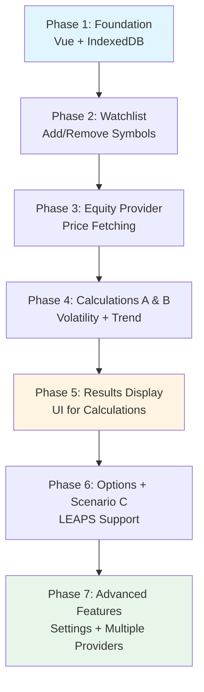

# Trading Decision App

## Project Requirements Document (PRD)

**Version:** 2.0  
**Goal:** Build a simple decision-support application that calculates and compares expected returns for holding versus selling QQQM to buy individual stocks or LEAPS calls.

Create a no-build Vue app that runs in a browser and uses IndexedDB to persist data.

---

## 1. Purpose

Build a personal investment decision-support app that:

1. Maintains a **watchlist of 25 stock symbols** (QQQM is automatically included and not part of the watchlist)
2. Calculates expected returns (per-dollar invested) for three scenarios:
   - **A)** Hold QQQM now, set limit order to sell at target price that triggers during time horizon (with confidence intervals)
   - **B)** Sell QQQM now and buy a stock, then sell at target price (with confidence intervals)
   - **C)** Sell QQQM now and buy a LEAPS call, then sell at target price (with confidence intervals)
3. Recommends the **single best trade** based on highest expected return
4. Shows **exact trade details** (ticker, price, expiration/strike for LEAPS)
5. Displays **target prices** with confidence intervals (67%, 95%, 99%) and **target dates** (selected LEAPS expiration dates)
6. Shows **the math** behind each calculation
7. Allows **parameter adjustment** with clear explanations
8. Supports **configurable data providers** with explicit failure handling

**Non-goal:** Charts, backtesting, notifications, position management, exit signals, or multiple concurrent positions.

**Audience:** Single user who needs transparent, math-based trading recommendations.

---

## 1.5 Implementation Roadmap

This section provides a phased approach to building the application incrementally. Each phase builds on the previous one, allowing you to test and validate functionality at each step.

### Phase 1: Foundation (Week 1)

**Goal:** Get a working Vue app with IndexedDB persistence.

**Prerequisites:** None - this is the starting point.

**Deliverables:**
1. Create `http/index.html` with Vue 3 from CDN
2. Set up IndexedDB database with all object stores (empty initially)
3. Create basic Vue app structure (Header, MainContent, Footer components)
4. Implement IndexedDB initialization and connection utilities
5. Add basic styling for layout structure

**Success Criteria:**
- [ ] App loads in browser without console errors
- [ ] IndexedDB database `trading-decision-app` created successfully (visible in DevTools)
- [ ] All 6 object stores exist: `watchlist`, `settings`, `dataCache`, `providerConfig`, `calculationResults`, `qqqmPrice`
- [ ] Basic UI structure visible (header, main content area, footer)
- [ ] Vue app reactive data works (test with simple counter or message)

**Testing Checklist:**
- **What to test:** IndexedDB database creation
  - **How:** Open browser DevTools → Application tab → IndexedDB → Verify `trading-decision-app` database exists with all stores
  - **Expected:** Database and all stores visible, no errors in console
  - **Common pitfalls:** Forgetting to handle database upgrade events, not checking browser IndexedDB support

- **What to test:** Vue app initialization
  - **How:** Open browser console, verify no Vue warnings or errors, check that `app` variable exists
  - **Expected:** Clean console, Vue app mounted successfully
  - **Common pitfalls:** Vue CDN link incorrect, trying to use Vue 2 syntax with Vue 3

- **What to test:** Basic reactivity
  - **How:** Add a simple reactive data property (e.g., `message: 'Hello'`), display in template, change value in console
  - **Expected:** Template updates automatically when data changes
  - **Common pitfalls:** Not using `ref()` or `reactive()` for Vue 3, incorrect template syntax

**Estimated Duration:** 3-5 days

**Code Skeleton:**
```html
<!DOCTYPE html>
<html lang="en">
<head>
  <meta charset="UTF-8">
  <title>Trading Decision App</title>
  <script src="https://unpkg.com/vue@3/dist/vue.global.js"></script>
  <style>
    /* Basic styles */
  </style>
</head>
<body>
  <div id="app">
    <header>Header</header>
    <main>Main Content</main>
    <footer>Footer</footer>
  </div>
  <script>
    const { createApp } = Vue;
    
    // IndexedDB utilities will go here
    
    createApp({
      data() {
        return {
          message: 'App initialized'
        };
      }
    }).mount('#app');
  </script>
</body>
</html>
```

### Phase 2: Watchlist Management (Week 1-2)

**Goal:** Add/remove symbols, persist to IndexedDB.

**Prerequisites:** Phase 1 complete (Vue app and IndexedDB working).

**Deliverables:**
1. Watchlist UI (add/remove buttons, symbol input field)
2. IndexedDB read/write operations for watchlist store
3. Basic validation (max 25 symbols, no duplicates, case-insensitive)
4. Display current watchlist with symbol list
5. Watchlist persistence (loads on page refresh)

**Success Criteria:**
- [ ] Can add symbol to watchlist via UI
- [ ] Watchlist persists after page refresh (loaded from IndexedDB)
- [ ] Can remove symbols from watchlist
- [ ] Max 25 symbols enforced (disable add button when full, show message)
- [ ] Duplicate symbols rejected (case-insensitive)
- [ ] Empty state handled (show message when watchlist is empty)

**Testing Checklist:**
- **What to test:** Add symbol functionality
  - **How:** Enter symbol (e.g., "AAPL") in input field, click add button
  - **Expected:** Symbol appears in watchlist, stored in IndexedDB
  - **Common pitfalls:** Not handling async IndexedDB operations, forgetting to update UI after add

- **What to test:** Persistence after refresh
  - **How:** Add symbols, refresh page, check watchlist
  - **Expected:** All symbols still present after refresh
  - **Common pitfalls:** Not loading watchlist on app initialization, IndexedDB read errors not handled

- **What to test:** Remove symbol
  - **How:** Click remove button next to a symbol
  - **Expected:** Symbol removed from UI and IndexedDB
  - **Common pitfalls:** Not updating UI state after removal, IndexedDB delete errors

- **What to test:** Validation - max 25 symbols
  - **How:** Add 25 symbols, try to add 26th
  - **Expected:** Add button disabled or error message shown, 26th symbol not added
  - **Common pitfalls:** Not checking count before allowing add, off-by-one errors

- **What to test:** Validation - duplicate symbols
  - **How:** Add "AAPL", try to add "aapl" or "AAPL" again
  - **Expected:** Duplicate rejected with error message
  - **Common pitfalls:** Case-sensitive comparison, not normalizing symbol before checking

**Estimated Duration:** 3-5 days

**Isolation Testing:**
- Test IndexedDB operations independently: Create a test function that adds/reads/removes symbols without UI
- Test validation logic independently: Create pure functions for validation, test with various inputs

### Phase 3: Equity Data Provider (Week 2-3)

**Goal:** Fetch current prices for watchlist symbols.

**Prerequisites:** Phase 2 complete (watchlist management working).

**Deliverables:**
1. Provider interface implementation (start with Alpha Vantage)
2. IndexedDB caching for price data (5-minute cache for current prices)
3. Manual QQQM price entry UI (always available, not just on failure)
4. Data status indicator showing last fetch time
5. Error handling for API failures (network errors, invalid keys, rate limits)
6. Basic provider configuration UI (API key input)

**Success Criteria:**
- [ ] Can fetch current price for a symbol via API
- [ ] Prices cached in IndexedDB `dataCache` store
- [ ] Can manually enter QQQM price (stored in `qqqmPrice` store)
- [ ] Shows data freshness status (last fetch timestamp)
- [ ] Handles API errors gracefully (shows error message, allows retry)
- [ ] Respects rate limits (queues requests, shows rate limit status)

**Testing Checklist:**
- **What to test:** Fetch price for symbol
  - **How:** Configure API key, add symbol to watchlist, trigger price fetch
  - **Expected:** Price fetched and displayed, stored in IndexedDB cache
  - **Common pitfalls:** CORS errors (need proxy), not handling async API calls, API key not configured

- **What to test:** Cache functionality
  - **How:** Fetch price, refresh page, check if price loaded from cache
  - **Expected:** Price loaded from cache if <5 minutes old, no API call made
  - **Common pitfalls:** Not checking cache age, not storing cache timestamp

- **What to test:** Manual QQQM price entry
  - **How:** Enter QQQM price manually, verify stored in `qqqmPrice` store
  - **Expected:** Manual price stored, used in calculations, clear indicator of manual vs provider price
  - **Common pitfalls:** Not storing source type (provider vs manual), not validating numeric input

- **What to test:** Error handling - invalid API key
  - **How:** Enter invalid API key, try to fetch price
  - **Expected:** Clear error message, link to settings, cached data used if available
  - **Common pitfalls:** Generic error messages, not distinguishing error types

- **What to test:** Error handling - rate limiting
  - **How:** Make rapid API calls (exceed rate limit)
  - **Expected:** Requests queued, rate limit message shown, exponential backoff
  - **Common pitfalls:** Not implementing request queue, not tracking rate limit status

**Estimated Duration:** 5-7 days

**Isolation Testing:**
- Test provider interface independently: Create mock provider, test with hardcoded responses
- Test caching logic independently: Test cache age checks, cache invalidation
- Test error handling independently: Simulate various error responses, verify error messages

### Phase 4: Basic Calculations - Scenarios A & B (Week 3-4)

**Goal:** Calculate expected returns for holding QQQM vs buying stock.

**Prerequisites:** Phase 3 complete (price data fetching working).

**Deliverables:**
1. Historical volatility calculation (historical method only - see Section 6.1)
2. Trend projection (linear method only - see Section 6.2)
3. Confidence intervals (normal distribution method - see Section 6.1)
4. Scenario A calculation (Hold QQQM) - see Section 2.3
5. Scenario B calculation (Buy Stock) - see Section 2.3
6. Use hardcoded time horizon (550 calendar days) - no LEAPS yet
7. Historical price data fetching (252 trading days minimum)

**Success Criteria:**
- [ ] Can calculate volatility from historical price data (annualized using 252 trading days)
- [ ] Can project target price using linear trend on log prices
- [ ] Can calculate confidence intervals (67%, 95%, 99%) for target prices
- [ ] Can calculate Scenario A expected return (Hold QQQM)
- [ ] Can calculate Scenario B expected return (Buy Stock)
- [ ] Results stored in calculation results structure (see Section 5.3)
- [ ] Calculations use same time horizon (550 days) for both scenarios

**Testing Checklist:**
- **What to test:** Volatility calculation
  - **How:** Use known historical data (e.g., AAPL with 252 days), calculate volatility
  - **Expected:** Volatility matches expected value (verify with manual calculation or known benchmark)
  - **Common pitfalls:** Using calendar days instead of trading days, not annualizing correctly, incorrect log returns formula

- **What to test:** Trend projection
  - **How:** Use historical data, project target price 550 days forward
  - **Expected:** Target price reasonable (not extreme), projection uses log prices
  - **Common pitfalls:** Using linear regression on prices instead of log prices, incorrect time conversion

- **What to test:** Confidence intervals
  - **How:** Calculate 67%, 95%, 99% confidence intervals for target price
  - **Expected:** Intervals widen with higher confidence, values reasonable
  - **Common pitfalls:** Incorrect z-scores, not using log-normal distribution, wrong time horizon conversion

- **What to test:** Scenario A calculation
  - **How:** Calculate expected return for holding QQQM
  - **Expected:** Return calculated as `(Target QQQM Price - Current QQQM Price) / Current QQQM Price`
  - **Common pitfalls:** Using wrong price, incorrect formula, not handling negative returns

- **What to test:** Scenario B calculation
  - **How:** Calculate expected return for buying stock
  - **Expected:** Return calculated as `(Target Stock Price - Current Stock Price) / Current Stock Price`
  - **Common pitfalls:** Using wrong price, incorrect formula, not using same time horizon as Scenario A

- **What to test:** Insufficient historical data
  - **How:** Test with symbol that has <252 days of history
  - **Expected:** Warning shown, uses available data, indicates reduced confidence
  - **Common pitfalls:** Not checking data sufficiency, crashing on insufficient data

**Estimated Duration:** 7-10 days

**Isolation Testing:**
- Test calculations with mock data: Create test functions with hardcoded price arrays, verify calculations
- Test each calculation independently: Test volatility, trend, confidence intervals separately before combining
- Use known test cases: Find symbols with known volatility/trend, verify calculations match

### Phase 5: Results Display (Week 4)

**Goal:** Show calculations in user-friendly format.

**Prerequisites:** Phase 4 complete (calculations working).

**Deliverables:**
1. Top recommendation card (best of A or B scenarios)
2. Scenario comparison table (A and B columns only, Scenario C column shows "N/A")
3. Calculation details panel (expandable per symbol/scenario)
4. Basic styling and responsive layout
5. Empty state handling (when watchlist empty or no calculations)

**Success Criteria:**
- [ ] Can see top recommendation (highest expected return at 95% confidence)
- [ ] Can see all symbols with A and B returns in table format
- [ ] Can expand calculation details to see step-by-step math
- [ ] UI is responsive (works on desktop and mobile)
- [ ] Color coding works (green for positive, red for negative returns)
- [ ] Table sortable by columns
- [ ] Empty states handled gracefully

**Testing Checklist:**
- **What to test:** Top recommendation display
  - **How:** Add symbols, run calculations, check top recommendation card
  - **Expected:** Card shows symbol with highest return, scenario type, expected return, target price
  - **Common pitfalls:** Not finding max correctly, showing wrong scenario, formatting issues

- **What to test:** Scenario comparison table
  - **How:** View table with multiple symbols
  - **Expected:** All symbols listed, A and B returns shown, best scenario highlighted per symbol
  - **Common pitfalls:** Not displaying all symbols, incorrect return values, missing highlights

- **What to test:** Calculation details expansion
  - **How:** Click to expand details for a symbol/scenario
  - **Expected:** Shows volatility, trend, confidence intervals, step-by-step calculation
  - **Common pitfalls:** Not showing all details, incorrect values, poor formatting

- **What to test:** Responsive design
  - **How:** Resize browser window, test on mobile device
  - **Expected:** Layout adapts, table scrollable on mobile, components stack vertically
  - **Common pitfalls:** Fixed widths, overflow issues, touch targets too small

- **What to test:** Empty states
  - **How:** Clear watchlist, check UI
  - **Expected:** Helpful message shown, add symbol prompt visible
  - **Common pitfalls:** Showing errors instead of empty state, not guiding user

**Estimated Duration:** 3-5 days

**Isolation Testing:**
- Test UI with mock data: Create hardcoded calculation results, test display without calculations
- Test components independently: Build recommendation card and table separately, test with static data

### Phase 6: Options Provider + Scenario C (Week 5-6)

**Goal:** Add LEAPS support and Scenario C calculations.

**Prerequisites:** Phase 5 complete (results display working).

**Deliverables:**
1. Options provider interface (start with one provider - Polygon.io or Tradier)
2. LEAPS selection logic (see Section 6.3)
3. Black-Scholes implementation (see Section 6.3.1)
4. Scenario C calculation (see Section 2.3)
5. Dynamic time horizon (from selected LEAPS expiration date)
6. Update Scenario A and B to use dynamic time horizon (from LEAPS)

**Success Criteria:**
- [ ] Can fetch LEAPS contracts for a symbol
- [ ] Can select best LEAPS per symbol (by DTE around 18 months, then best delta)
- [ ] Can calculate Scenario C expected return using Black-Scholes
- [ ] Time horizon comes from LEAPS expiration (not hardcoded)
- [ ] Scenario C shows "N/A" when no LEAPS available
- [ ] All three scenarios use same time horizon (from selected LEAPS)

**Testing Checklist:**
- **What to test:** LEAPS fetching
  - **How:** Configure options provider, fetch LEAPS for symbol
  - **Expected:** LEAPS contracts returned, filtered by DTE range
  - **Common pitfalls:** CORS issues, incorrect API format, not handling empty results

- **What to test:** LEAPS selection
  - **How:** Fetch LEAPS, verify selection logic
  - **Expected:** Contract selected with DTE closest to 550 days, delta closest to 0.75
  - **Common pitfalls:** Incorrect filtering logic, not handling edge cases (no matches)

- **What to test:** Black-Scholes calculation
  - **How:** Calculate option price with known inputs
  - **Expected:** Price matches expected value (verify with online calculator or known values)
  - **Common pitfalls:** Incorrect normal CDF implementation, wrong time units, incorrect Greeks

- **What to test:** Scenario C calculation
  - **How:** Calculate expected return for LEAPS scenario
  - **Expected:** Return calculated correctly, uses probability-weighted approach
  - **Common pitfalls:** Incorrect expected premium calculation, not accounting for time decay

- **What to test:** Dynamic time horizon
  - **How:** Select LEAPS with different expiration, verify time horizon used in all scenarios
  - **Expected:** All scenarios (A, B, C) use same time horizon from selected LEAPS
  - **Common pitfalls:** Still using hardcoded 550 days, not updating scenarios when LEAPS changes

**Estimated Duration:** 10-14 days

**Isolation Testing:**
- Test Black-Scholes independently: Create test function with known inputs, verify outputs
- Test LEAPS selection independently: Test selection logic with mock LEAPS data
- Test time horizon logic independently: Verify time horizon calculation from expiration date

### Phase 7: Polish & Advanced Features (Week 6+)

**Goal:** Settings, multiple providers, advanced calculations.

**Prerequisites:** Phase 6 complete (all three scenarios working).

**Deliverables:**
1. Settings UI for all parameters (see Section 2.4)
2. Multiple provider support (equity and options providers)
3. Advanced volatility methods (GARCH, EWMA - see Section 6.1)
4. Bootstrap confidence intervals (see Section 6.1)
5. Advanced trend methods (exponential, polynomial - see Section 6.2)
6. Export/import functionality (see Section 3.6)
7. Performance optimizations (caching, debouncing, Web Workers if needed)

**Success Criteria:**
- [ ] All parameters adjustable via settings UI
- [ ] Can switch between multiple equity providers
- [ ] Can switch between multiple options providers
- [ ] Advanced volatility methods work (GARCH, EWMA)
- [ ] Bootstrap confidence intervals work
- [ ] Advanced trend methods work (exponential, polynomial)
- [ ] Export/import functionality works
- [ ] Performance targets met (see Section 7.2)

**Testing Checklist:**
- **What to test:** Settings UI
  - **How:** Adjust parameters, verify calculations update
  - **Expected:** Changes applied immediately, persisted to IndexedDB
  - **Common pitfalls:** Not validating parameter ranges, not persisting changes

- **What to test:** Multiple providers
  - **How:** Switch between providers, verify data fetching works
  - **Expected:** Provider switch seamless, data format normalized
  - **Common pitfalls:** Provider-specific code not abstracted, format differences not handled

- **What to test:** Advanced calculations
  - **How:** Select GARCH/EWMA, verify volatility calculation
  - **Expected:** Volatility values reasonable, different from historical method
  - **Common pitfalls:** Incorrect GARCH/EWMA implementation, parameter constraints not enforced

- **What to test:** Export/import
  - **How:** Export data, clear app, import data
  - **Expected:** All data restored correctly, no data loss
  - **Common pitfalls:** Not exporting all stores, import validation errors, version mismatches

**Estimated Duration:** 10-14 days

**Isolation Testing:**
- Test each advanced method independently: GARCH, EWMA, bootstrap, polynomial regression
- Test provider switching independently: Verify provider interface abstraction works

---

## 1.6 MVP Definition

**Minimum Viable Product (MVP) Scope:** Phases 1-5

The MVP includes all functionality needed to make basic trading decisions between holding QQQM and buying individual stocks. It excludes LEAPS/options functionality and advanced calculation methods.

### MVP Includes:

- **Foundation:** Working Vue app with IndexedDB persistence
- **Watchlist Management:** Add/remove up to 25 symbols, persistence
- **Equity Data Provider:** Fetch current prices (one provider), manual QQQM entry, caching
- **Basic Calculations:** Scenarios A and B only
  - Historical volatility (historical method only)
  - Linear trend projection
  - Normal distribution confidence intervals
  - Hardcoded time horizon (550 calendar days)
- **Results Display:** Top recommendation, scenario comparison table, calculation details

### MVP Excludes:

- **Scenario C:** LEAPS/options functionality
- **Advanced Volatility Methods:** GARCH, EWMA
- **Advanced Trend Methods:** Exponential smoothing, polynomial regression
- **Bootstrap Confidence Intervals:** Normal distribution only
- **Multiple Providers:** Single equity provider only
- **Settings UI:** Uses hardcoded default parameters
- **Export/Import:** Not included in MVP
- **Dynamic Time Horizon:** Uses fixed 550-day horizon

### MVP Success Criteria:

The MVP is considered complete when:

1. **Functional:** All MVP features work end-to-end
   - Can add symbols to watchlist
   - Can fetch prices for symbols
   - Can calculate Scenarios A and B
   - Can see top recommendation and comparison table

2. **Testable:** MVP can be validated independently
   - Calculations produce reasonable results
   - UI displays correctly
   - Data persists across page refreshes

3. **Usable:** MVP provides value to user
   - User can make informed decision between holding QQQM vs buying stock
   - All calculations are transparent and verifiable
   - Error handling works for common failure cases

### MVP Validation:

To validate MVP completion:

1. **End-to-End Test:** Add 5-10 symbols, fetch prices, run calculations, verify results displayed
2. **Persistence Test:** Refresh page, verify watchlist and data still present
3. **Calculation Verification:** Manually verify one calculation (volatility, trend, expected return)
4. **Error Handling Test:** Test with invalid API key, network failure, insufficient data

### Post-MVP:

After MVP is complete and validated, proceed to Phase 6 (Options Provider + Scenario C) and Phase 7 (Advanced Features) to add full functionality as specified in the PRD.

---

## 1.7 Start Here Guide

This section provides exact first steps to begin development. Follow these steps to get a working foundation, then proceed to Phase 1 details in Section 1.5.

### Step 1: Create File Structure

Create the following file structure:

```
trading/
└── http/
    ├── index.html
    └── js/ (optional, for local Vue.js if not using CDN)
```

### Step 2: Create Basic HTML File

Create `http/index.html` with the following minimal structure:

```html
<!DOCTYPE html>
<html lang="en">
<head>
  <meta charset="UTF-8">
  <meta name="viewport" content="width=device-width, initial-scale=1.0">
  <title>Trading Decision App</title>
  <script src="https://unpkg.com/vue@3/dist/vue.global.js"></script>
  <style>
    * {
      margin: 0;
      padding: 0;
      box-sizing: border-box;
    }
    body {
      font-family: -apple-system, BlinkMacSystemFont, 'Segoe UI', Roboto, sans-serif;
    }
    #app {
      min-height: 100vh;
      display: flex;
      flex-direction: column;
    }
    header, footer {
      padding: 1rem;
      background: #f5f5f5;
    }
    main {
      flex: 1;
      padding: 1rem;
    }
  </style>
</head>
<body>
  <div id="app">
    <header>
      <h1>Trading Decision App</h1>
    </header>
    <main>
      <p>{{ message }}</p>
    </main>
    <footer>
      <p>Version 1.0</p>
    </footer>
  </div>
  <script>
    const { createApp } = Vue;
    
    createApp({
      data() {
        return {
          message: 'App initialized successfully!'
        };
      }
    }).mount('#app');
  </script>
</body>
</html>
```

### Step 3: Test Basic Vue App

1. Open `http/index.html` in a web browser (Chrome recommended)
2. Open browser DevTools (F12 or Cmd+Option+I)
3. Check Console tab - should see no errors
4. Verify page displays "App initialized successfully!"
5. In Console, try: `app.message = 'Hello World'` - page should update

### Step 4: Add IndexedDB Initialization

Add IndexedDB setup code to the script section:

```javascript
// IndexedDB Database Name
const DB_NAME = 'trading-decision-app';
const DB_VERSION = 1;

// Initialize IndexedDB
function initDB() {
  return new Promise((resolve, reject) => {
    const request = indexedDB.open(DB_NAME, DB_VERSION);
    
    request.onerror = () => reject(request.error);
    request.onsuccess = () => resolve(request.result);
    
    request.onupgradeneeded = (event) => {
      const db = event.target.result;
      
      // Create object stores
      if (!db.objectStoreNames.contains('watchlist')) {
        db.createObjectStore('watchlist', { keyPath: 'symbol' });
      }
      if (!db.objectStoreNames.contains('settings')) {
        db.createObjectStore('settings', { keyPath: 'category' });
      }
      if (!db.objectStoreNames.contains('dataCache')) {
        db.createObjectStore('dataCache', { keyPath: 'symbol' });
      }
      if (!db.objectStoreNames.contains('providerConfig')) {
        db.createObjectStore('providerConfig', { keyPath: 'providerType' });
      }
      if (!db.objectStoreNames.contains('calculationResults')) {
        db.createObjectStore('calculationResults', { keyPath: 'symbol' });
      }
      if (!db.objectStoreNames.contains('qqqmPrice')) {
        db.createObjectStore('qqqmPrice', { keyPath: 'id' });
      }
    };
  });
}

// Vue app
const { createApp } = Vue;

createApp({
  data() {
    return {
      message: 'App initialized successfully!',
      db: null
    };
  },
  async mounted() {
    try {
      this.db = await initDB();
      this.message = 'Database initialized!';
      console.log('IndexedDB ready:', this.db);
    } catch (error) {
      this.message = 'Database error: ' + error.message;
      console.error('IndexedDB error:', error);
    }
  }
}).mount('#app');
```

### Step 5: Verify IndexedDB Works

1. Refresh the page
2. Open DevTools → Application tab → IndexedDB
3. Verify `trading-decision-app` database exists
4. Verify all 6 object stores are present:
   - `watchlist`
   - `settings`
   - `dataCache`
   - `providerConfig`
   - `calculationResults`
   - `qqqmPrice`
5. Check Console - should see "IndexedDB ready:" with database object

### Next Steps:

Once you've completed these steps:

1. ✅ You have a working Vue 3 app
2. ✅ You have IndexedDB set up with all required stores
3. ✅ You can verify everything works in DevTools

**Proceed to Phase 1** (Section 1.5) for detailed implementation of the foundation, or continue building incrementally following the phase roadmap.

**Quick Reference:**
- Phase 1 details: See Section 1.5, Phase 1
- IndexedDB schema: See Section 4.2
- Code organization: See Section 4.1

---

## 1.8 Dependency Graph

This section clarifies what depends on what, what can be built in parallel, and the critical path through the implementation phases.

### Phase Dependencies

The phases must be completed in this order:

```
Phase 1 (Foundation)
    ↓
Phase 2 (Watchlist Management)
    ↓
Phase 3 (Equity Data Provider)
    ↓
Phase 4 (Basic Calculations - A & B)
    ↓
Phase 5 (Results Display)
    ↓
Phase 6 (Options Provider + Scenario C)
    ↓
Phase 7 (Polish & Advanced Features)
```

### Dependency Flow Diagram



### What Can Be Built in Parallel

While phases must be completed sequentially, some work within phases can be parallelized:

**Within Phase 2:**
- Watchlist UI and IndexedDB operations can be developed in parallel (UI with mock data, then connect to IndexedDB)

**Within Phase 3:**
- Provider interface and caching logic can be developed separately
- Manual QQQM entry UI independent of provider fetching

**Within Phase 4:**
- Volatility calculation and trend projection can be developed independently
- Scenario A and Scenario B calculations are independent (use same inputs)

**Within Phase 5:**
- Recommendation card and comparison table can be built separately
- UI components can use mock calculation data initially

**Within Phase 6:**
- LEAPS selection logic and Black-Scholes implementation are independent
- Options provider interface separate from Scenario C calculation

**Within Phase 7:**
- Settings UI and advanced calculation methods are independent
- Export/import functionality separate from other features

### Critical Path

The critical path (minimum work to get MVP working) is:

1. **Phase 1** → Foundation (required for everything)
2. **Phase 2** → Watchlist (required for data fetching)
3. **Phase 3** → Price data (required for calculations)
4. **Phase 4** → Calculations (core functionality)
5. **Phase 5** → Display (required to see results)

**Phases 6 and 7 are not on the critical path for MVP** - they add advanced features but MVP (Phases 1-5) can be completed and validated independently.

### Dependency Clarifications

**Scenario A works without Scenario C:**
- ✅ Scenario A (Hold QQQM) only needs QQQM price and time horizon
- ✅ Scenario C (LEAPS) is completely optional
- ✅ MVP includes only Scenarios A and B

**UI can be built before calculations:**
- ✅ Build UI components with mock/hardcoded data
- ✅ Connect real calculations later
- ✅ This allows parallel development and testing

**Calculations can use hardcoded time horizon before LEAPS:**
- ✅ Phase 4 uses fixed 550-day horizon
- ✅ Phase 6 adds dynamic time horizon from LEAPS
- ✅ This allows MVP without options functionality

**Data providers can be added incrementally:**
- ✅ Start with one equity provider (Alpha Vantage)
- ✅ Add options provider later (Phase 6)
- ✅ Add multiple providers last (Phase 7)

### Parallelization Strategy

To maximize development speed:

1. **Build UI with mocks first:** Create UI components using hardcoded data, then connect real data/calculations
2. **Develop calculations independently:** Test calculation functions with mock data before integrating
3. **Build provider interfaces separately:** Test providers independently before integrating
4. **Incremental integration:** Connect pieces together after each is tested independently

This approach allows you to:
- Test each piece in isolation
- Identify bugs early
- Work on multiple aspects simultaneously
- Validate functionality at each step

---

## 1.9 Testing Overview

This section provides a general testing philosophy and strategies for testing components in isolation throughout development.

### Testing Philosophy

**Incremental Testing:** Test each piece as you build it, not just at the end.

**Isolation Testing:** Test components independently before integrating them.

**Mock Data First:** Build and test with hardcoded/mock data before connecting real data sources.

**Verify in Browser:** Use browser DevTools extensively - it's your primary testing tool.

### Testing Tools

**Browser DevTools (Essential):**
- **Console:** Check for errors, test JavaScript functions
- **Application Tab → IndexedDB:** Inspect database, verify data storage
- **Network Tab:** Monitor API calls, check responses
- **Elements Tab:** Inspect DOM, test CSS

**No External Testing Framework Required:**
- This is a no-build app, so no Jest/Mocha setup needed
- Use browser console and manual testing
- Create simple test functions in console for validation

### Testing IndexedDB Operations Independently

**Create Test Functions:**

```javascript
// Test adding to watchlist
async function testAddSymbol(symbol) {
  const db = await initDB();
  const tx = db.transaction('watchlist', 'readwrite');
  const store = tx.objectStore('watchlist');
  await store.add({ symbol, addedAt: Date.now(), lastPrice: 0, lastUpdated: 0 });
  console.log('Added:', symbol);
}

// Test reading from watchlist
async function testGetWatchlist() {
  const db = await initDB();
  const tx = db.transaction('watchlist', 'readonly');
  const store = tx.objectStore('watchlist');
  const all = await store.getAll();
  console.log('Watchlist:', all);
  return all;
}

// Run in console: testAddSymbol('AAPL'), then testGetWatchlist()
```

**Verify in DevTools:**
- Application → IndexedDB → trading-decision-app → watchlist
- Verify data stored correctly
- Test read/write/delete operations

### Testing Calculations with Mock Data

**Create Test Data:**

```javascript
// Mock historical price data (252 days)
const mockPriceData = [
  { date: '2023-01-01', close: 100 },
  { date: '2023-01-02', close: 101 },
  // ... 250 more days
];

// Test volatility calculation
function testVolatility(prices) {
  // Your volatility calculation function
  const returns = calculateReturns(prices);
  const volatility = calculateVolatility(returns);
  console.log('Volatility:', volatility);
  return volatility;
}

// Test with known data
testVolatility(mockPriceData);
```

**Verify Calculations:**
- Use known test cases (symbols with published volatility)
- Compare against online calculators
- Verify formulas match Section 6.1 specifications

### Testing Data Providers Independently

**Create Mock Provider:**

```javascript
// Mock provider for testing
const mockProvider = {
  getName: () => 'Mock Provider',
  getCurrentPrice: async (symbol) => {
    // Return hardcoded price
    return 150.25;
  },
  getHistoricalPrices: async (symbol, days) => {
    // Return mock historical data
    return generateMockHistory(days);
  }
};

// Test provider interface
async function testProvider() {
  const price = await mockProvider.getCurrentPrice('AAPL');
  console.log('Price:', price);
  const history = await mockProvider.getHistoricalPrices('AAPL', 252);
  console.log('History length:', history.length);
}
```

**Test Real Provider:**
- Configure API key
- Test with real API calls
- Verify error handling (invalid key, rate limits)

### Testing UI Components with Static Data

**Build UI with Hardcoded Data:**

```javascript
// Vue component with mock data
createApp({
  data() {
    return {
      // Mock calculation results
      results: [
        { symbol: 'AAPL', scenarioA: 0.15, scenarioB: 0.20, best: 'B' },
        { symbol: 'MSFT', scenarioA: 0.12, scenarioB: 0.18, best: 'B' }
      ],
      topRecommendation: { symbol: 'AAPL', scenario: 'B', return: 0.20 }
    };
  }
}).mount('#app');
```

**Test UI Independently:**
- Verify layout and styling
- Test interactions (expand/collapse, sorting)
- Test responsive design
- Connect real data later

### Testing Checklist Template

For each feature you build, test:

1. **Happy Path:** Does it work with valid inputs?
2. **Error Handling:** Does it handle errors gracefully?
3. **Edge Cases:** What happens with empty data, invalid inputs, boundary conditions?
4. **Persistence:** Does data persist after page refresh?
5. **Integration:** Does it work with other components?

### Common Testing Patterns

**Test Function Pattern:**
```javascript
// Create test function for each feature
function testFeature() {
  // Setup
  const input = createTestInput();
  
  // Execute
  const result = featureFunction(input);
  
  // Verify
  console.assert(result.expected === result.actual, 'Test failed');
  console.log('Test passed:', result);
}
```

**Mock Data Pattern:**
```javascript
// Create mock data generators
function createMockWatchlist(count) {
  return Array.from({ length: count }, (_, i) => ({
    symbol: `SYM${i}`,
    addedAt: Date.now() - i * 1000,
    lastPrice: 100 + i,
    lastUpdated: Date.now()
  }));
}
```

**Isolation Test Pattern:**
```javascript
// Test calculation function independently
function testCalculation() {
  const mockInputs = {
    currentPrice: 100,
    targetPrice: 110,
    timeHorizon: 550
  };
  
  const result = calculateExpectedReturn(mockInputs);
  
  // Verify result
  console.log('Calculation result:', result);
  // Expected: (110 - 100) / 100 = 0.10 (10%)
}
```

### Testing Best Practices

1. **Test Early:** Test each function as you write it
2. **Test Small:** Test individual functions before testing integration
3. **Use Console:** Browser console is your testing environment
4. **Verify Visually:** Check UI in browser, not just console logs
5. **Test Edge Cases:** Empty data, invalid inputs, boundary conditions
6. **Document Tests:** Keep test functions in code comments for reference

### Integration Testing

After testing components independently:

1. **Connect Pieces:** Connect UI to calculations, calculations to data
2. **End-to-End Test:** Add symbol → fetch price → calculate → display
3. **Persistence Test:** Refresh page, verify data persists
4. **Error Flow Test:** Test error scenarios end-to-end

---

## 2. Core Functionality

### 2.1 Watchlist Management

- Maintain exactly 25 stock symbols
- Add/remove tickers (validate against active data provider)
- Watchlist persists in IndexedDB
- QQQM is automatically included and is NOT part of the watchlist (QQQM cannot be added/removed)

### 2.2 Data Requirements

**Required Data:**
- Current price for QQQM (special symbol, automatically included) and all watchlist symbols
- Historical price data for volatility/trend calculations
- Data freshness timestamp

**Desired Data:**
- Options chain data for LEAPS candidates

**Data Providers:**

**Initial Provider Recommendations:**

**Equity Data Providers (for current prices and historical data):**
- **Alpha Vantage** (Recommended for initial implementation)
  - Free tier: 5 API calls/minute, 500 calls/day
  - Suitable for development and testing with small watchlists
  - Provides current quotes and daily historical data
  - See Section 4.3.1 for detailed specifications
- **Twelve Data** (Alternative)
  - Free tier: 800 requests/day, 2 requests/minute
  - Better rate limits for larger watchlists
  - See Section 4.3.1 for detailed specifications
- **Finnhub** (Alternative)
  - Free tier: 60 API calls/minute
  - Good for real-time quotes
  - See Section 4.3.1 for detailed specifications

**Options Data Providers (for LEAPS contracts):**
- **Polygon.io** (Recommended if budget allows)
  - Starter tier: ~$29/month
  - Free tier: Very limited (1 request/minute, suitable for testing only)
  - Provides full options chain data including Greeks (delta, gamma, theta, vega)
  - See Section 4.3.1 for detailed specifications
- **Tradier** (Alternative)
  - Sandbox: Free for testing
  - Production: Requires account approval
  - Provides options chain with Greeks
  - See Section 4.3.1 for detailed specifications
- **Yahoo Finance (Unofficial)** (Fallback only)
  - No official API, unreliable
  - Requires web scraping or proxy
  - Not recommended for production use

**Provider Configuration:**
- User can select and configure equity data provider
- User can select and configure options data provider
- Provider selection stored in settings
- CORS handling: Most providers require proxy configuration (see Section 4.3.2)
- Explicit failure handling (see Section 6.5 for detailed behaviors):
  - Equity provider failures: Use cached data if available, show warnings, disable affected scenarios, provide retry
  - Options provider failures: Mark Scenario C as "N/A", continue with A and B, use cached data if available, provide retry
  - Both providers fail: Use all available cached data, show comprehensive error, allow manual refresh

### 2.3 Calculation Engine

Calculate expected profit rate (per-dollar invested) using a dynamically determined time horizon based on selected LEAPS expiration.

**Time Horizon Determination:**
- Time horizon is dynamically determined by the selected LEAPS expiration date
- For each symbol, examine available LEAPS contracts with DTE around 18 months (target ~550 calendar days, configurable range)
- Select LEAPS by best delta for buying calls (closest to target delta within configured range)
- Use the selected LEAPS expiration date as the time horizon for all three scenarios (A, B, C) for that symbol
- If no LEAPS available for a symbol, use a default time horizon (configurable, default: 550 calendar days from current date)
- **Note:** Time horizon and DTE use **calendar days** (not trading days). When converting to years for calculations, use 365.25 days per year. Volatility annualization uses 252 trading days (see Section 6.1).

**Scenario A) Hold QQQM**
- Current QQQM price
- Target price QQQM will reach by LEAPS expiration date (with 67%, 95%, 99% confidence)
- Assumes limit order to sell at target price that triggers during the time horizon (by expiration date)
- Expected profit rate (per-dollar invested): `(Target QQQM Price - Current QQQM Price) / Current QQQM Price`

**Scenario B) Buy Stock**
- Current stock price
- Target price stock will reach by LEAPS expiration date (with 67%, 95%, 99% confidence)
- Expected profit rate (per-dollar invested): `(Target Stock Price - Current Stock Price) / Current Stock Price`

**Scenario C) Buy LEAPS Call**
- Available LEAPS call contracts (stock, expiration date, strike price, premium price from data provider)
- Selected LEAPS contract (chosen by best delta for buying calls, with DTE around 18 months)
- Expected LEAPS call premium at target stock price by expiration date (accounting for time decay and probability distribution)
- Expected profit rate (per-dollar invested): `(Expected LEAPS Premium at Target - Current LEAPS Premium) / Current LEAPS Premium`

**Selection Logic:**
- Compare expected profit rates across all scenarios
- Recommend the scenario with highest expected profit rate at 95% confidence
- If multiple scenarios tie, prefer: QQQM > Stock > LEAPS (user-configurable preference)
  - **Rationale:** QQQM is preferred for lower risk (diversification across many stocks), Stock for direct exposure to a single company, LEAPS for leveraged exposure. This default prioritizes lower risk when returns are equal. User can configure this preference in settings.

### 2.4 Parameter Configuration

All calculation parameters must be:
- Adjustable via settings UI
- Clearly explained (what it does, why it matters, typical range)
- Applied immediately to recalculations

**Key Parameters:**
- Confidence interval calculation method (volatility model, lookback period)
- Target price calculation method (trend projection, volatility bands, etc.)
- LEAPS selection criteria (DTE target range around 18 months, target delta, max premium)
- Risk-free rate (for time value calculations)
- Volatility lookback period
- Trend calculation method
- Default time horizon (used when no LEAPS available, default: 550 calendar days)

### 2.5 Presentation Format

**Main Dashboard displays:**

1. **Top Recommendation Card**
   - Single best trade (scenario with highest expected return at 95% confidence)
   - Clear visual highlight (e.g., green border, "RECOMMENDED" badge)
   - Shows: ticker, scenario type (QQQM/Stock/LEAPS), expected profit rate (per-dollar invested), target price, target date (LEAPS expiration)
   - Expandable section showing exact trade details (strike, expiration if LEAPS)
   - One-click expand to show calculation math

2. **Scenario Comparison Table**
   - All 25 watchlist symbols listed
   - For each symbol, columns showing
     - Scenario A expected return (67%, 95%, 99% confidence) - Hold QQQM
     - Scenario B expected return (67%, 95%, 99% confidence) - Buy Stock
     - Scenario C expected return (67%, 95%, 99% confidence) or "N/A" if no LEAPS available - Buy LEAPS
   - Highlight best scenario per symbol (highest expected return at 95% confidence)
   - Sortable by any column
   - Color coding: green for positive returns, red for negative, gray for N/A
   - Click any row to expand and see detailed calculations

3. **Calculation Details Panel** (expandable per symbol/scenario)
   - Current price and target price with confidence intervals (67%, 95%, 99%)
   - Target date (selected LEAPS expiration date, or default time horizon if no LEAPS)
   - Step-by-step calculation breakdown:
     - Volatility calculation method and inputs
     - Trend projection method and inputs
     - Confidence interval derivation
     - Expected profit rate formula with values plugged in (per-dollar invested)
     - For Scenario C: LEAPS selection criteria, pricing model assumptions, time decay calculations
   - Raw data used (historical prices, lookback period, selected LEAPS contract details, etc.)

4. **Parameter Adjustment Sidebar**
   - Collapsible settings panel
   - Grouped by category (Volatility, Trend, LEAPS, General)
   - Each parameter shows:
     - Current value
     - Input field (number, dropdown, or text as appropriate)
     - Brief explanation (tooltip or inline help text)
     - Typical range or valid options
   - "Apply" button to recalculate (or auto-apply with debounce)
   - "Reset to Defaults" option

5. **Data Status Indicator**
   - Shows last data refresh timestamp
   - Indicates data provider status (connected/error)
   - Manual refresh button
   - Warning if data is stale (>1 hour old)

6. **QQQM Price Display and Manual Entry**
   - Shows current QQQM price prominently in header or data status area
   - When QQQM price fetch fails: Show manual entry input field
   - Manual entry persists in IndexedDB
   - Clear indicator when using manually entered price vs. provider-fetched price
   - "Update QQQM Price" button to refresh from provider or enter manually

7. **Watchlist Management Section**
   - Current watchlist (25 symbols max)
   - Add symbol input with validation
   - Remove symbol buttons
   - Symbol validation feedback (invalid ticker, already in list, etc.)

**Display Principles:**
- Math transparency: All calculations must be visible and verifiable
- No hidden assumptions: Every number has a source and method
- Immediate feedback: Parameter changes trigger recalculation (with debounce for performance)
- Mobile-responsive: Layout adapts to smaller screens (stack components vertically)
- Accessibility: Keyboard navigation, screen reader support, sufficient color contrast

### 2.6 First Launch / Onboarding

**Initial State:**
- Empty watchlist on first launch (no default or example symbols)
- All settings initialized to default values (see Section 5.2)
- No cached data (fresh IndexedDB database)

**Welcome Experience:**
- Show welcome message with brief app purpose and instructions
- Display "Add Your First Symbol" prompt prominently
- Guide user through initial setup:
  1. Add symbols to watchlist (up to 25)
  2. Configure data providers (if needed)
  3. Review/adjust calculation parameters (optional, defaults work)
- Show data status indicator with setup instructions if providers not configured

**Empty State Handling:**
- When watchlist is empty:
  - Show placeholder message: "Add symbols to your watchlist to get started"
  - Display "Add Symbol" button prominently
  - Hide calculation results and recommendation card
  - Show watchlist management section with clear instructions
- After first symbol is added, show data fetching status and calculation results

**Data Provider Setup:**
- If no provider configured on first launch:
  - Show warning in data status indicator
  - Link to settings for provider configuration
  - Provide guidance on obtaining API keys
  - Allow user to proceed with manual symbol entry (validation will occur when provider is configured)

---

## 3. User Interface Structure

### 3.1 Main Dashboard Layout

**Layout Structure:**
- Single-page application (SPA) with no routing
- Header: App title, QQQM price display/manual entry, data status indicator, settings toggle
- Main content area: Top recommendation card (full width)
- Secondary content: Scenario comparison table (scrollable if needed)
- Sidebar: Collapsible parameter adjustment panel (slides in from right)
- Footer: Minimal (version info, data provider credits if applicable)

**Component Hierarchy:**
```
App
├── Header
│   ├── Title
│   ├── QQQMPriceDisplay
│   ├── DataStatusIndicator
│   └── SettingsToggle
├── MainContent
│   ├── TopRecommendationCard
│   ├── ScenarioComparisonTable
│   └── CalculationDetailsPanel (modal/expandable)
├── Sidebar (collapsible)
│   └── ParameterAdjustmentPanel
└── WatchlistManagement (modal or inline section)
```

### 3.2 Watchlist Management UI

**Location:** Modal dialog or dedicated section in main content area

**Components:**
- Current watchlist display (grid or list of 25 symbols)
- Each symbol shows: ticker, current price, last updated
- Add symbol input field with autocomplete/validation
- Remove button per symbol (with confirmation for accidental clicks)
- Validation feedback messages (invalid ticker, duplicate, max reached)
- Save/Cancel buttons (auto-save to IndexedDB on change)

**Constraints:**
- Enforce 25 symbol maximum (disable add when full)
- Validate symbols against active data provider before adding
- Show loading state while validating

### 3.3 Settings/Parameters Configuration UI

**Location:** Collapsible sidebar panel (right side)

**Organization:**
- Tabbed or accordion interface grouped by category:
  - **Volatility Settings:** Lookback period, calculation method, confidence interval method
  - **Trend Settings:** Projection method, smoothing parameters, polynomial degree (when polynomial method selected)
  - **LEAPS Settings:** DTE range (min/max), target delta range, max premium filter
  - **General Settings:** Risk-free rate, tie-breaker preference (QQQM > Stock > LEAPS)
  - **Data Provider Settings:** Equity provider selection, options provider selection, API keys/config

**Input Types:**
- Number inputs with min/max validation
- Dropdown selects for method choices
- Range sliders for intuitive adjustment (with numeric display)
- Text inputs for API keys (masked/password type)

**UX Features:**
- Inline help text or tooltips for each parameter
- "Reset to Defaults" button per category
- "Apply Changes" button (or auto-apply with visual feedback)
- Unsaved changes indicator if user modifies but doesn't apply
- **Polynomial Degree Selector:** When "polynomial" is selected as projection method, show dropdown with options 2 (default) or 3
- **Overfitting Warning:** When polynomial degree 3 is selected, display warning message: "Degree 3 may overfit to noise. Consider degree 2 for more stable projections."
- **Degree Selection Help Text:** Explain trade-offs: "Degree 2 (quadratic) is recommended for financial data - less prone to overfitting. Degree 3 (cubic) can capture more complex patterns but may fit noise."

### 3.4 Data Provider Configuration UI

**Location:** Within Settings sidebar, under "Data Provider Settings" tab

**Components:**
- Provider selection dropdowns (equity and options separate)
- Configuration form (API keys, endpoints, rate limits) - fields vary by provider
- Test connection button
- Status indicator (connected, error, rate limited)
- Provider-specific help/instructions link

**QQQM Price Management:**
- Display current QQQM price (from provider or manual entry)
- Manual entry input field (always available, not just on failure)
- "Fetch from Provider" button to attempt automatic fetch
- Status indicator: "Provider" or "Manual Entry" with timestamp
- Clear visual distinction between provider-fetched and manually entered prices

**Provider Support:**
- Design for extensibility (easy to add new providers)
- Provider-specific configuration schemas
- Graceful degradation when provider unavailable

### 3.5 Responsive Design Considerations

**Breakpoints:**
- Desktop (>1024px): Full layout with sidebar
- Tablet (768-1024px): Sidebar becomes overlay/modal
- Mobile (<768px): Stack all components vertically, sidebar full-screen modal

**Mobile Optimizations:**
- Touch-friendly button sizes (min 44x44px)
- Swipeable table rows for actions
- Bottom sheet for parameter adjustments
- Simplified table view (horizontal scroll with sticky first column)

**Accessibility:**
- ARIA labels for all interactive elements
- Keyboard navigation support (Tab, Enter, Escape)
- Focus indicators visible
- Screen reader announcements for dynamic updates
- Color contrast meets WCAG AA standards

### 3.6 Data Export/Import UI

**Location:** Settings sidebar (under "General Settings" tab) or footer

**Export Functionality:**
- Export button triggers download of JSON file
- File format: Single JSON file named `trading-decision-app-backup-YYYY-MM-DD.json`
- Data included:
  - `watchlist`: All watchlist entries
  - `settings`: All parameter settings by category
  - `providerConfig`: All provider configurations (API keys included)
  - Option to exclude `dataCache` (user-selectable checkbox to reduce file size)
- Export includes metadata: export timestamp, app version

**Import Functionality:**
- Import button opens file picker (accepts `.json` files only)
- Validates file structure before importing
- Shows preview of data to be imported (watchlist count, settings categories)
- Options:
  - Merge with existing data (adds new symbols, updates settings)
  - Replace all data (clears existing data first)
- Confirmation dialog before import completes
- Error handling: Invalid file format, corrupted data, version mismatches
- Success feedback: Shows count of imported items

**Use Cases:**
- Backup before clearing browser data
- Transfer configuration between devices
- Share watchlist/settings with other users
- Restore after data loss

---

## 4. Technical Requirements

### 4.1 Application Architecture

**No-Build Vue App:**
- Use Vue 3 (loaded via CDN or from http/js)
- Single HTML file with inline Vue app code (all application logic in index.html)
- External JavaScript libraries (e.g., Vue.js) may be loaded via CDN or from local js/ directory
- No build step, no bundler, no Node.js required
- All dependencies loaded via HTML `<head>` (CDN links or local file references)
- Vanilla JavaScript for IndexedDB operations (or lightweight wrapper)

**File Structure:**
```
http/
├── index.html (single file with all application code)
└── js/ (optional: Vue.js and any other JavaScript libraries if not using CDN)
```

**Note:** The "single HTML file" requirement means all application code (Vue components, calculation logic, etc.) should be in index.html. External libraries like Vue.js can be loaded from CDN or local files, but no build/compilation step is required.

#### 4.1.1 Code Organization Template

Since all code lives in a single `index.html` file, organization is critical for maintainability. Follow this structure to keep code readable and organized as the application grows.

**Complete File Structure:**

```html
<!DOCTYPE html>
<html lang="en">
<head>
  <!-- ============================================
       SECTION 1: HEAD - METADATA & DEPENDENCIES
       ============================================ -->
  <meta charset="UTF-8">
  <meta name="viewport" content="width=device-width, initial-scale=1.0">
  <title>Trading Decision App</title>
  
  <!-- External Dependencies (CDN or local) -->
  <script src="https://unpkg.com/vue@3/dist/vue.global.js"></script>
  <!-- Optional: Add other libraries here -->
  
  <!-- ============================================
       SECTION 2: STYLES
       ============================================ -->
  <style>
    /* Global Styles */
    * { margin: 0; padding: 0; box-sizing: border-box; }
    
    /* Component Styles */
    /* Header, Main, Footer, etc. */
    
    /* Responsive Styles */
    @media (max-width: 768px) { /* Mobile styles */ }
  </style>
</head>
<body>
  <!-- ============================================
       SECTION 3: HTML TEMPLATE
       ============================================ -->
  <div id="app">
    <!-- Vue template markup here -->
    <header><!-- Header content --></header>
    <main><!-- Main content --></main>
    <footer><!-- Footer content --></footer>
  </div>

  <!-- ============================================
       SECTION 4: JAVASCRIPT CODE
       ============================================ -->
  <script>
    // ============================================
    // SECTION 4.1: CONSTANTS & CONFIGURATION
    // ============================================
    const DB_NAME = 'trading-decision-app';
    const DB_VERSION = 1;
    const CACHE_DURATION_PRICE = 5 * 60 * 1000; // 5 minutes
    const CACHE_DURATION_HISTORICAL = 60 * 60 * 1000; // 1 hour
    
    // ============================================
    // SECTION 4.2: INDEXEDDB UTILITIES
    // ============================================
    // Database initialization
    function initDB() { /* ... */ }
    
    // Watchlist operations
    async function addToWatchlist(db, symbol) { /* ... */ }
    async function removeFromWatchlist(db, symbol) { /* ... */ }
    async function getWatchlist(db) { /* ... */ }
    
    // Settings operations
    async function getSettings(db, category) { /* ... */ }
    async function saveSettings(db, category, settings) { /* ... */ }
    
    // Data cache operations
    async function getCachedData(db, symbol) { /* ... */ }
    async function cacheData(db, symbol, data) { /* ... */ }
    
    // QQQM price operations
    async function getQQQMPrice(db) { /* ... */ }
    async function saveQQQMPrice(db, price, source) { /* ... */ }
    
    // ============================================
    // SECTION 4.3: DATA PROVIDER INTERFACES
    // ============================================
    // Equity Provider Interface
    class EquityProvider {
      constructor(config) { /* ... */ }
      async getCurrentPrice(symbol) { /* ... */ }
      async getHistoricalPrices(symbol, days) { /* ... */ }
      async validateSymbol(symbol) { /* ... */ }
    }
    
    // Alpha Vantage Implementation
    class AlphaVantageProvider extends EquityProvider {
      // Implementation details
    }
    
    // Options Provider Interface
    class OptionsProvider {
      constructor(config) { /* ... */ }
      async getLEAPS(symbol, minDTE, maxDTE) { /* ... */ }
    }
    
    // Provider Factory
    function createEquityProvider(providerName, config) { /* ... */ }
    function createOptionsProvider(providerName, config) { /* ... */ }
    
    // ============================================
    // SECTION 4.4: CALCULATION FUNCTIONS
    // ============================================
    // Volatility Calculations
    function calculateHistoricalVolatility(priceData, lookbackDays) { /* ... */ }
    function calculateGARCHVolatility(priceData, alpha, beta) { /* ... */ }
    function calculateEWMAVolatility(priceData, lambda) { /* ... */ }
    
    // Trend Projections
    function calculateLinearTrend(priceData, timeHorizon) { /* ... */ }
    function calculateExponentialTrend(priceData, timeHorizon) { /* ... */ }
    function calculatePolynomialTrend(priceData, timeHorizon, degree) { /* ... */ }
    
    // Confidence Intervals
    function calculateConfidenceIntervals(currentPrice, targetPrice, volatility, timeHorizon) { /* ... */ }
    function calculateBootstrapConfidenceIntervals(priceData, timeHorizon, iterations) { /* ... */ }
    
    // Black-Scholes & Options
    function blackScholesCall(S, K, r, T, sigma) { /* ... */ }
    function calculateGreeks(S, K, r, T, sigma) { /* ... */ }
    function normalCDF(x) { /* ... */ }
    function normalPDF(x) { /* ... */ }
    
    // Scenario Calculations
    function calculateScenarioA(qqqmPrice, targetPrice, timeHorizon) { /* ... */ }
    function calculateScenarioB(stockPrice, targetPrice, timeHorizon) { /* ... */ }
    function calculateScenarioC(leapsContract, targetPrice, volatility) { /* ... */ }
    
    // LEAPS Selection
    function selectBestLEAPS(leapsContracts, targetDTE, targetDelta) { /* ... */ }
    
    // ============================================
    // SECTION 4.5: VUE APP DEFINITION
    // ============================================
    const { createApp } = Vue;
    
    createApp({
      data() {
        return {
          // Reactive data properties
          watchlist: [],
          calculationResults: [],
          topRecommendation: null,
          // ... other data
        };
      },
      
      computed: {
        // Computed properties
      },
      
      methods: {
        // Component methods
        async addSymbol(symbol) { /* ... */ },
        async removeSymbol(symbol) { /* ... */ },
        async fetchPrices() { /* ... */ },
        async calculateResults() { /* ... */ },
        // ... other methods
      },
      
      async mounted() {
        // Initialize database
        this.db = await initDB();
        
        // Load watchlist
        this.watchlist = await getWatchlist(this.db);
        
        // Load settings
        // Initialize providers
        // Load cached data
      }
    }).mount('#app');
  </script>
</body>
</html>
```

#### 4.1.2 Section-by-Section Explanation

**Section 1: Head - Metadata & Dependencies**
- Place all `<meta>` tags, `<title>`, and external script/style links here
- Keep dependencies at the top for clarity
- Comment this section clearly

**Section 2: Styles**
- Organize CSS in logical groups: Global → Components → Responsive
- Use comments to separate style sections
- Keep styles close to where they're used (in same file)

**Section 3: HTML Template**
- Vue template markup goes inside `<div id="app">`
- Use semantic HTML structure
- Keep template readable with comments for major sections

**Section 4: JavaScript Code**
- **4.1 Constants:** All configuration constants at the top
- **4.2 IndexedDB Utilities:** All database operations grouped together
- **4.3 Data Provider Interfaces:** Provider classes and factory functions
- **4.4 Calculation Functions:** Pure calculation functions (no side effects)
- **4.5 Vue App Definition:** Vue app setup and component logic

#### 4.1.3 Best Practices for Single-File Organization

**1. Use Clear Section Comments:**
```javascript
// ============================================
// SECTION NAME
// ============================================
// Description of what this section contains
```

**2. Group Related Functions:**
- Keep all IndexedDB functions together
- Keep all calculation functions together
- Keep all provider code together

**3. Order Matters:**
- Constants first (used everywhere)
- Utilities before code that uses them
- Vue app definition last (uses everything above)

**4. Keep Functions Pure When Possible:**
- Calculation functions should be pure (no side effects)
- Makes testing easier
- Makes code more maintainable

**5. Use Descriptive Names:**
- Function names should clearly indicate purpose
- Variable names should be self-documenting
- Avoid abbreviations unless universally understood

**6. Add JSDoc Comments for Complex Functions:**
```javascript
/**
 * Calculates historical volatility from price data
 * @param {Array} priceData - Array of {date, close} objects
 * @param {number} lookbackDays - Number of trading days to use
 * @returns {number} Annualized volatility (as decimal)
 */
function calculateHistoricalVolatility(priceData, lookbackDays) {
  // Implementation
}
```

**7. Separate Concerns:**
- Data access (IndexedDB) separate from business logic (calculations)
- UI logic (Vue) separate from calculations
- Provider code separate from app code

**8. Handle Errors Consistently:**
- Use try/catch blocks for async operations
- Provide user-friendly error messages
- Log errors to console for debugging

#### 4.1.4 Maintaining Readability as Code Grows

**As the file grows, maintain organization by:**

1. **Keeping sections clearly separated** with comment headers
2. **Not mixing concerns** - don't put IndexedDB code in calculation functions
3. **Using helper functions** - break complex functions into smaller pieces
4. **Documenting complex logic** - add comments explaining "why" not just "what"
5. **Regular refactoring** - if a section gets too long, consider breaking it into logical sub-sections

**File Size Guidelines:**
- Target: Keep file under 3000 lines if possible
- If exceeding: Consider if code can be simplified or better organized
- Remember: Single file is a requirement, but organization is key to maintainability

**Example: Growing a Section**
```javascript
// SECTION 4.4: CALCULATION FUNCTIONS

// 4.4.1: Volatility Calculations
function calculateHistoricalVolatility() { /* ... */ }
function calculateGARCHVolatility() { /* ... */ }

// 4.4.2: Trend Projections
function calculateLinearTrend() { /* ... */ }
function calculateExponentialTrend() { /* ... */ }

// 4.4.3: Confidence Intervals
function calculateConfidenceIntervals() { /* ... */ }
```

This sub-sectioning helps navigate large files and maintains logical grouping.

### 4.2 IndexedDB Schema

**Database Name:** `trading-decision-app`

**Object Stores:**

1. **watchlist**
   - Key: `symbol` (string)
   - Value: `{ symbol: string, addedAt: timestamp, lastPrice: number, lastUpdated: timestamp }`

2. **settings**
   - Key: `category` (string, e.g., "volatility", "trend", "leaps")
   - Value: `{ category: string, parameters: object }`

3. **dataCache**
   - Key: `symbol` (string)
   - Value: `{ symbol: string, priceData: array, optionsData: object, cachedAt: timestamp }`

4. **providerConfig**
   - Key: `providerType` (string, "equity" or "options")
   - Value: `{ providerType: string, providerName: string, config: object }`

5. **calculationResults** (optional, for performance caching)
   - Key: `symbol` (string)
   - Value: `{ symbol: string, results: CalculationResults, calculatedAt: timestamp }`
   - Note: This store caches calculation results to avoid recomputation when inputs haven't changed. Results are invalidated when parameters or data change.

6. **qqqmPrice**
   - Key: `"current"` (single entry)
   - Value: `{ price: number, source: "provider" | "manual", lastUpdated: timestamp, providerFetchedAt: timestamp | null }`

**Indexes:**
- `watchlist` store: Index on `addedAt` for sorting
- `dataCache` store: Index on `cachedAt` for expiration checks
- `calculationResults` store: Index on `calculatedAt` for cache expiration

### 4.3 Data Provider Integration Patterns

**Provider Interface:**
All providers must implement a standard interface:

```javascript
// Equity Provider Interface
{
  getName(): string
  getCurrentPrice(symbol: string): Promise<number>
  getHistoricalPrices(symbol: string, days: number): Promise<PriceData[]>
  validateSymbol(symbol: string): Promise<boolean>
  configure(config: object): void
}

// Options Provider Interface
{
  getName(): string
  getLEAPS(symbol: string, minDTE: number, maxDTE: number): Promise<LEAPSContract[]>
  getOptionPrice(contractId: string): Promise<number>
  configure(config: object): void
}
```

**Note on contractId:** The `contractId` is a unique identifier provided by the options data provider. It is used to fetch specific contract prices via `getOptionPrice()`. The contractId format is provider-specific but must uniquely identify a contract (symbol, strike, expiration combination). See Section 5.5 for the LEAPS Contract data structure.

**Provider Registration:**
- Provider registry pattern (factory function)
- Dynamic provider selection based on user settings
- Explicit failure handling with specific behaviors (see Section 6.5)
- Error handling with user-friendly messages and retry options

**Caching Strategy:**
- Cache price data for 5 minutes (configurable)
- Cache options data for 15 minutes (configurable)
- Cache historical data for 1 hour (configurable)
- Manual refresh always bypasses cache

#### 4.3.1 Provider Specifications

**Alpha Vantage (Equity Data Provider)**

**Free Tier Limits:**
- 5 API calls per minute
- 500 API calls per day
- Rate limit: 1 call per 12 seconds recommended

**Endpoints:**
- Current Quote: `https://www.alphavantage.co/query?function=GLOBAL_QUOTE&symbol={SYMBOL}&apikey={API_KEY}`
- Historical Daily: `https://www.alphavantage.co/query?function=TIME_SERIES_DAILY&symbol={SYMBOL}&outputsize=full&apikey={API_KEY}`

**Response Format:**
```json
// GLOBAL_QUOTE response
{
  "Global Quote": {
    "01. symbol": "AAPL",
    "05. price": "150.25",
    "07. latest trading day": "2024-01-15"
  }
}

// TIME_SERIES_DAILY response
{
  "Time Series (Daily)": {
    "2024-01-15": {
      "1. open": "149.50",
      "2. high": "151.00",
      "3. low": "149.00",
      "4. close": "150.25",
      "5. volume": "50000000"
    }
  }
}
```

**CORS:** Limited support, may require proxy

**Twelve Data (Equity Data Provider)**

**Free Tier Limits:**
- 800 requests per day
- 2 requests per minute
- Rate limit: 1 call per 30 seconds recommended

**Endpoints:**
- Current Quote: `https://api.twelvedata.com/quote?symbol={SYMBOL}&apikey={API_KEY}`
- Historical Daily: `https://api.twelvedata.com/time_series?symbol={SYMBOL}&interval=1day&outputsize={DAYS}&apikey={API_KEY}`

**Response Format:**
```json
// Quote response
{
  "symbol": "AAPL",
  "name": "Apple Inc.",
  "exchange": "NASDAQ",
  "currency": "USD",
  "datetime": "2024-01-15",
  "timestamp": 1705276800,
  "close": "150.25",
  "open": "149.50",
  "high": "151.00",
  "low": "149.00",
  "volume": "50000000"
}

// Time Series response
{
  "meta": {
    "symbol": "AAPL",
    "interval": "1day"
  },
  "values": [
    {
      "datetime": "2024-01-15",
      "open": "149.50",
      "high": "151.00",
      "low": "149.00",
      "close": "150.25",
      "volume": "50000000"
    }
  ]
}
```

**CORS:** Limited support, may require proxy

**Finnhub (Equity Data Provider)**

**Free Tier Limits:**
- 60 API calls per minute
- Rate limit: 1 call per second recommended

**Endpoints:**
- Current Quote: `https://finnhub.io/api/v1/quote?symbol={SYMBOL}&token={API_KEY}`
- Historical Daily: `https://finnhub.io/api/v1/stock/candle?symbol={SYMBOL}&resolution=D&from={FROM_TIMESTAMP}&to={TO_TIMESTAMP}&token={API_KEY}`

**Response Format:**
```json
// Quote response
{
  "c": 150.25,  // current price
  "h": 151.00,  // high
  "l": 149.00,  // low
  "o": 149.50,  // open
  "pc": 148.75, // previous close
  "t": 1705276800  // timestamp
}

// Candle response
{
  "c": [150.25, 151.00, ...],  // close prices
  "h": [151.00, 152.00, ...],  // high prices
  "l": [149.00, 150.00, ...],  // low prices
  "o": [149.50, 150.50, ...],  // open prices
  "s": "ok",
  "t": [1705276800, 1705363200, ...],  // timestamps
  "v": [50000000, 51000000, ...]  // volumes
}
```

**CORS:** Limited support, may require proxy

**Polygon.io (Options Data Provider)**

**Free Tier Limits:**
- 1 request per minute
- Suitable for testing only

**Paid Tier (Starter):**
- ~$29/month
- Higher rate limits
- Full options chain access

**Endpoints:**
- Options Chain: `https://api.polygon.io/v3/snapshot/options/{UNDERLYING}?apikey={API_KEY}`
- Historical Aggregates: `https://api.polygon.io/v2/aggs/ticker/{TICKER}/range/{MULTIPLIER}/{TIMESPAN}/{FROM}/{TO}?apikey={API_KEY}`

**Response Format:**
```json
// Options Snapshot response
{
  "status": "OK",
  "results": [
    {
      "details": {
        "contract_type": "call",
        "exercise_style": "american",
        "expiration_date": "2025-06-20",
        "shares_per_contract": 100,
        "strike_price": 150.0,
        "ticker": "O:AAPL250620C00150000"
      },
      "greeks": {
        "delta": 0.75,
        "gamma": 0.02,
        "theta": -0.05,
        "vega": 0.15
      },
      "last_quote": {
        "bid": 10.50,
        "ask": 10.75,
        "last_updated": 1705276800000
      },
      "implied_volatility": 0.25,
      "open_interest": 5000,
      "volume": 1000
    }
  ]
}
```

**CORS:** Limited support, may require proxy

**Tradier (Options Data Provider)**

**Sandbox:**
- Free for testing
- Full API access with test data

**Production:**
- Requires account approval
- Real market data

**Endpoints:**
- Options Chain: `https://sandbox.tradier.com/v1/markets/options/chains?symbol={SYMBOL}&expiration={EXPIRATION}`
- Current Quote: `https://sandbox.tradier.com/v1/markets/quotes?symbols={SYMBOL}`

**Response Format:**
```json
// Options Chain response
{
  "options": {
    "option": [
      {
        "symbol": "AAPL250620C00150000",
        "description": "AAPL Jun 20 2025 $150.00 Call",
        "exch": "Z",
        "type": "option",
        "last": 10.50,
        "change": 0.25,
        "volume": 1000,
        "open": 10.25,
        "high": 10.75,
        "low": 10.00,
        "close": 10.50,
        "bid": 10.50,
        "ask": 10.75,
        "underlying": "AAPL",
        "strike": 150.0,
        "greeks": {
          "mid": 10.625,
          "bid": 10.50,
          "ask": 10.75,
          "last": 10.50,
          "volume": 1000,
          "open_interest": 5000,
          "volatility": 0.25,
          "delta": 0.75,
          "gamma": 0.02,
          "theta": -0.05,
          "vega": 0.15,
          "rho": 0.01,
          "phi": 0.00,
          "bid_iv": 0.24,
          "mid_iv": 0.25,
          "ask_iv": 0.26,
          "smv_vol": 0.23,
          "updated_at": "2024-01-15T16:00:00"
        }
      }
    ]
  }
}
```

**CORS:** May require proxy, supports OAuth for authentication

#### 4.3.2 CORS Handling Strategy

**Problem:**
Most financial data APIs do not support CORS (Cross-Origin Resource Sharing) headers, preventing direct browser access from client-side JavaScript.

**Solutions:**

1. **Proxy Server Configuration (Recommended)**
   - User-configurable proxy endpoint in provider settings
   - Proxy server handles:
     - Adding CORS headers to API responses
     - Securing API keys (keys stored server-side, not exposed to browser)
     - Rate limiting and request queuing
     - Error handling and retries
   - Proxy endpoint format: `https://user-proxy.example.com/api/proxy`
   - App sends requests to proxy, proxy forwards to actual API
   - User must deploy their own proxy server (simple Node.js/Express server recommended)

2. **Provider with Native CORS Support (Preferred if Available)**
   - Some providers offer CORS-enabled endpoints
   - May require specific API key configuration or plan tier
   - Check provider documentation for CORS support
   - If available, use direct API calls without proxy

3. **Browser Extension (Not Recommended)**
   - Browser extensions can bypass CORS restrictions
   - Not suitable for web app deployment
   - Requires users to install extension
   - Not a viable solution for this application

**Implementation:**
- Provider interface abstracts CORS handling
- Each provider implementation checks for proxy configuration
- If proxy URL configured, route requests through proxy
- If no proxy and provider doesn't support CORS, show clear error message with setup instructions
- Settings UI includes proxy configuration section (see Section 3.4)
- Error handling distinguishes CORS errors from API errors (see Section 6.5)

**Proxy Configuration in Settings:**
- Proxy URL field (optional)
- Test proxy connection button
- Clear instructions on setting up proxy server
- Link to example proxy server code/documentation

### 4.4 Calculation Engine Structure

**Modular Design:**
- Separate modules for each calculation type:
  - `volatility-calculator.js`: Volatility and confidence intervals
  - `trend-calculator.js`: Price projections and target dates
  - `leaps-calculator.js`: LEAPS selection and pricing
  - `scenario-comparator.js`: Compare scenarios and select best

**Calculation Flow:**
1. For each symbol, fetch available LEAPS contracts and select best LEAPS (by DTE around 18 months, then best delta)
2. Determine time horizon for each symbol (selected LEAPS expiration date, or default if no LEAPS)
3. Fetch current data (prices, historical, options if available)
4. Calculate volatility for each symbol
5. Project target prices with confidence intervals (using time horizon from step 2)
6. Calculate expected returns for each scenario (A, B, C) using same time horizon
7. Select best scenario per symbol
8. Rank all symbols by best expected return
9. Return top recommendation

**Performance:**
- Calculations run asynchronously (Web Workers if needed for heavy computation)
- Debounce parameter changes (500ms) before recalculating
- Show loading states during calculations
- Cache calculation results until inputs change

### 4.5 Browser Compatibility

**Target Deployment Environment:**
- Chrome 143+
- Mobile browsers with IndexedDB support

**Browser APIs Available:**
- IndexedDB (for data persistence)
- Fetch API (for data provider calls)
- ES6+ JavaScript features (async/await, classes, modules)
- CSS Grid/Flexbox (for layout)

**Polyfills:**
- Include polyfills only if absolutely necessary
- Prefer native implementations
- Test on target browsers before adding polyfills

### 4.6 Security Considerations

**API Keys:**
- Store API keys in IndexedDB (not localStorage for better security)
- Never expose keys in client-side code comments or logs
- Warn user if keys are visible in browser DevTools
- Support key rotation without data loss

**Data Privacy:**
- All data stored locally (IndexedDB)
- No data sent to third parties except configured data providers
- User controls all data (can export/delete)
- No analytics or tracking by default

**Input Validation:**
- Validate all user inputs (symbols, parameters, API keys)
- Sanitize inputs before API calls
- Handle API errors gracefully (rate limits, invalid keys, network errors)

---

## 5. Data Models

### 5.1 Watchlist Data Structure

```javascript
{
  symbol: string,           // Ticker symbol (e.g., "AAPL")
  addedAt: number,          // Timestamp when added
  lastPrice: number,        // Last fetched price
  lastUpdated: number       // Timestamp of last price update
}
```

**Constraints:**
- Maximum 25 entries
- Symbols must be unique (case-insensitive)
- Symbols validated against active equity provider

**Note:** QQQM is NOT stored in the watchlist. QQQM is a special symbol automatically included in all calculations. See Section 5.8 for QQQM price storage.

### 5.2 Settings/Parameters Data Structure

```javascript
{
  volatility: {
    lookbackPeriod: number,        // Days (default: 252)
    calculationMethod: string,     // "historical" | "garch" | "ewma" (default: "historical")
    confidenceMethod: string,      // "normal" | "bootstrap" (default: "normal")
    garchAlpha: number,            // GARCH(1,1) alpha parameter (default: 0.1, range: 0 < α < 1)
    garchBeta: number,             // GARCH(1,1) beta parameter (default: 0.85, range: 0 < β < 1, constraint: α + β < 1)
    ewmaLambda: number,            // EWMA decay factor (default: 0.94, range: 0 < λ < 1, typical: 0.94-0.97 for daily returns)
    bootstrapIterations: number,   // Number of bootstrap iterations (default: 1000, range: 500-5000)
    bootstrapBlockLength: number | "auto"  // Block length for bootstrap (default: "auto" = n^(1/3), range: 3-20 trading days, or "auto")
  },
  trend: {
    projectionMethod: string,     // "linear" | "exponential" | "polynomial"
    smoothingPeriod: number,      // Days (default: 20)
    polynomialDegree: number      // Polynomial degree: 2 or 3 (default: 2, only used when projectionMethod is "polynomial")
  },
  leaps: {
    targetDTE: number,            // Target days to expiration in calendar days (default: 550, ~18 months)
    dteTolerance: number,         // Tolerance around target DTE in calendar days (default: 60)
    targetDelta: number,           // Target delta for buying calls (default: 0.75)
    deltaTolerance: number,        // Tolerance around target delta (default: 0.1)
    maxPremium: number,            // Maximum premium as % of stock price (default: 20)
    defaultTimeHorizon: number     // Default time horizon in calendar days if no LEAPS available (default: 550)
  },
  general: {
    riskFreeRate: number,          // Annual rate as decimal (default: 0.05)
    tieBreakerPreference: string   // "qqqm" | "stock" | "leaps" (default: "qqqm")
  }
}
```

**Storage:**
- Stored in IndexedDB `settings` store
- Keyed by category name (e.g., "volatility", "trend")
- Merged with defaults on app load
- Validated on save (ranges, valid options)

### 5.3 Calculation Results Data Structure

```javascript
{
  symbol: string,
  timeHorizon: string,  // ISO date string - selected LEAPS expiration date, or default if no LEAPS
  scenarios: {
    A: {  // Hold QQQM now, limit order to sell at target price
      currentPrice: number,
      targetPrice: {
        p67: number,
        p95: number,
        p99: number
      },
      targetDate: string,  // ISO date string - LEAPS expiration date (same for all scenarios)
      expectedReturn: {
        p67: number,  // As decimal (e.g., 0.15 = 15%) - per-dollar invested
        p95: number,
        p99: number
      },
      calculationDetails: {
        volatility: number,
        trendSlope: number,
        inputs: object
      }
    },
    B: {  // Sell QQQM → Buy Stock
      currentPrice: number,
      targetPrice: { p67, p95, p99 },
      targetDate: string,  // ISO date string - LEAPS expiration date (same for all scenarios)
      expectedReturn: { 
        p67: number,  // Per-dollar invested
        p95: number,
        p99: number
      },
      calculationDetails: { ... }
    },
    C: {  // Sell QQQM → Buy LEAPS
      currentPrice: number,
      selectedLEAPS: {
        contractId: string,
        strike: number,
        expiration: string,  // ISO date string - this becomes the targetDate
        premium: number,  // Current premium from data provider
        delta: number
      },
      targetPrice: { p67, p95, p99 },  // Target stock price
      targetDate: string,  // ISO date string - selected LEAPS expiration date
      expectedLEAPSPremium: { 
        p67: number,  // Expected premium at target price (accounting for time decay)
        p95: number,
        p99: number
      },
      expectedReturn: { 
        p67: number,  // Per-dollar invested: (expectedPremium - currentPremium) / currentPremium
        p95: number,
        p99: number
      },
      calculationDetails: { 
        pricingModel: string,  // Description of pricing model used
        timeDecayAssumptions: object,
        probabilityDistribution: object,
        ... 
      },
      available: boolean
    }
  },
  bestScenario: "A" | "B" | "C",
  bestExpectedReturn: number,  // At 95% confidence - per-dollar invested
  calculatedAt: number         // Timestamp
}
```

### 5.4 Price Data Structure

```javascript
{
  symbol: string,
  date: string,        // ISO date string
  open: number,
  high: number,
  low: number,
  close: number,
  volume: number
}
```

**Historical Data Array:**
- Array of PriceData objects
- Sorted by date (ascending)
- Minimum required: 252 days for annual volatility
- Cached in IndexedDB `dataCache` store

### 5.5 LEAPS Contract Data Structure

```javascript
{
  contractId: string,      // Unique identifier provided by options data provider, used to fetch contract prices
  symbol: string,
  strike: number,
  expiration: string,      // ISO date string
  dte: number,            // Days to expiration (calendar days)
  premium: number,        // Current option price
  delta: number,          // Option delta
  gamma: number,          // Option gamma
  theta: number,          // Option theta
  vega: number,           // Option vega
  impliedVolatility: number,  // Implied volatility (annualized, as decimal, e.g., 0.25 = 25%) - preferred source for Black-Scholes calculations when available
  volume: number,
  openInterest: number,
  bid: number,
  ask: number,
  lastUpdated: number     // Timestamp
}
```

**LEAPS Selection Criteria:**
- **Priority 1:** Filter by DTE around target (targetDTE ± dteTolerance from settings)
- **Priority 2:** Filter by delta range (targetDelta ± deltaTolerance from settings) for best delta for buying calls
- **Priority 3:** Filter by premium (maxPremium % of stock price from settings)
- Select contract with delta closest to targetDelta (within filtered set)
- If multiple match on delta, prefer longer DTE (more time value)
- Use selected LEAPS expiration date as time horizon for all scenarios

**Note on Implied Volatility:**
- The `impliedVolatility` field (when available from provider) is the preferred source for volatility in Black-Scholes calculations (see Section 6.3.1)
- If `impliedVolatility` is not available or invalid, fall back to historical volatility calculated from stock price history
- Store the volatility source used (provider IV vs. historical) in calculation details for transparency

### 5.6 Provider Configuration Data Structure

```javascript
{
  providerType: "equity" | "options",
  providerName: string,    // e.g., "alpha-vantage", "polygon", "tradier", "twelve-data", "finnhub", "custom"
  config: {
    apiKey: string,        // Encrypted or plain (user choice)
    baseUrl: string,       // API endpoint (optional, defaults to provider's standard endpoint)
    proxyUrl: string,      // Optional proxy server URL for CORS handling (e.g., "https://proxy.example.com/api")
    rateLimit: number,     // Requests per minute (optional, defaults to provider's free tier limit)
    customParams: object   // Provider-specific settings (e.g., outputsize for Alpha Vantage)
  },
  lastTested: number,      // Timestamp of last connection test
  status: "connected" | "error" | "rate_limited" | "cors_error" | "unknown"
}
```

**Provider-Specific Configuration Examples:**

**Alpha Vantage:**
```javascript
{
  providerType: "equity",
  providerName: "alpha-vantage",
  config: {
    apiKey: "YOUR_API_KEY",
    baseUrl: "https://www.alphavantage.co/query",  // Optional, defaults to this
    proxyUrl: "",  // Optional proxy for CORS
    rateLimit: 5,  // Free tier: 5 calls/minute
    customParams: {
      outputsize: "full"  // For historical data: "compact" (100 days) or "full"
    }
  }
}
```

**Polygon.io:**
```javascript
{
  providerType: "options",
  providerName: "polygon",
  config: {
    apiKey: "YOUR_API_KEY",
    baseUrl: "https://api.polygon.io",  // Optional, defaults to this
    proxyUrl: "",  // Optional proxy for CORS
    rateLimit: 1,  // Free tier: 1 call/minute (very limited)
    customParams: {}
  }
}
```

**Tradier:**
```javascript
{
  providerType: "options",
  providerName: "tradier",
  config: {
    apiKey: "YOUR_ACCESS_TOKEN",
    baseUrl: "https://sandbox.tradier.com/v1",  // Or "https://api.tradier.com/v1" for production
    proxyUrl: "",  // Optional proxy for CORS
    rateLimit: 120,  // Typical rate limit
    customParams: {
      accountId: "YOUR_ACCOUNT_ID"  // Required for some endpoints
    }
  }
}
```

**Twelve Data:**
```javascript
{
  providerType: "equity",
  providerName: "twelve-data",
  config: {
    apiKey: "YOUR_API_KEY",
    baseUrl: "https://api.twelvedata.com",  // Optional, defaults to this
    proxyUrl: "",  // Optional proxy for CORS
    rateLimit: 2,  // Free tier: 2 calls/minute
    customParams: {}
  }
}
```

**Finnhub:**
```javascript
{
  providerType: "equity",
  providerName: "finnhub",
  config: {
    apiKey: "YOUR_API_KEY",
    baseUrl: "https://finnhub.io/api/v1",  // Optional, defaults to this
    proxyUrl: "",  // Optional proxy for CORS
    rateLimit: 60,  // Free tier: 60 calls/minute
    customParams: {}
  }
}
```

### 5.7 IndexedDB Storage Schema Summary

**Database:** `trading-decision-app` (version 1)

**Object Stores:**
1. `watchlist` - Array of watchlist entries (max 25)
2. `settings` - Key-value pairs by category
3. `dataCache` - Cached price and options data by symbol
4. `providerConfig` - Provider configurations by type
5. `calculationResults` - Cached calculation results by symbol (optional, for performance)
6. `qqqmPrice` - QQQM price storage (single entry)

**Migration Strategy:**
- Use versioned IndexedDB schema
- Handle version upgrades gracefully
- Provide data export/import functionality for backups (see Section 3.6 for detailed specification)

### 5.8 QQQM Price Data Structure

```javascript
{
  price: number,              // Current QQQM price
  source: "provider" | "manual",  // How price was obtained
  lastUpdated: number,        // Timestamp of last update
  providerFetchedAt: number | null  // Timestamp of last successful provider fetch (null if never fetched)
}
```

**Storage:**
- Stored in IndexedDB `qqqmPrice` store
- Single entry with key `"current"`
- Updated when provider fetch succeeds or user manually enters price

---

## 6. Implementation Details

### 6.1 Confidence Interval Calculations

**Volatility Calculation:**

**Default Method: "historical" (Recommended for Initial Implementation)**
- Simple and transparent: standard deviation of log returns
- Steps:
  1. Fetch historical price data (default: 252 trading days)
  2. Calculate daily returns: `r_t = ln(P_t / P_{t-1})`
  3. Calculate annualized volatility: `σ = std(r_t) * √252`
- This is the default method and recommended starting point for transparency and simplicity

**GARCH(1,1) Method (Advanced, Optional)**
- Models time-varying volatility with autoregressive conditional heteroskedasticity
- **Variance Equation:** `σ²_t = ω + α * ε²_{t-1} + β * σ²_{t-1}`
  - Where:
    - `σ²_t` = conditional variance at time t
    - `ω` = long-term average variance (unconditional variance)
    - `α` = coefficient for ARCH term (sensitivity to recent shocks, default: 0.1)
    - `β` = coefficient for GARCH term (persistence of volatility, default: 0.85)
    - `ε²_{t-1}` = squared residual from previous period
    - `σ²_{t-1}` = conditional variance from previous period
- **Parameter Constraints:**
  - `α > 0`, `β > 0`, `α + β < 1` (required for stationarity)
  - `ω = (1 - α - β) * σ²_unconditional` (where σ²_unconditional is the unconditional variance from historical data)
- **Implementation:**
  1. Initialize σ²_0 using unconditional variance from historical returns
  2. Iteratively calculate σ²_t for each period using the variance equation
  3. Annualize final volatility: `σ_annual = √(σ²_t * 252)`
- **Note:** GARCH(1,1) requires iterative estimation and is more complex than historical method. Can be added in later iterations if needed.

**EWMA Method (Exponential Weighted Moving Average, Advanced, Optional)**
- Models volatility with exponentially decaying weights on past observations
- **Variance Equation:** `σ²_t = λ * σ²_{t-1} + (1-λ) * r²_t`
  - Where:
    - `σ²_t` = conditional variance at time t
    - `λ` = decay factor (default: 0.94, typical range: 0.94-0.97 for daily returns)
    - `r²_t` = squared return at time t
- **Parameter Constraints:**
  - `0 < λ < 1` (decay factor must be between 0 and 1)
  - Higher λ (closer to 1) = more weight on past volatility (more persistent)
  - Lower λ (closer to 0) = more weight on recent returns (more reactive)
- **Implementation:**
  1. Initialize σ²_0 using unconditional variance from historical returns
  2. Iteratively calculate σ²_t for each period using the EWMA equation
  3. Annualize final volatility: `σ_annual = √(σ²_t * 252)`
- **Note:** EWMA is simpler than GARCH but more complex than historical method. Can be added in later iterations if needed.

**Method Selection:**
- Default: "historical" (simplest, most transparent, recommended for initial implementation)
- Advanced methods (GARCH, EWMA) are optional and can be implemented in later phases
- User can select method in settings, with "historical" as the default

**Confidence Intervals for Target Price:**
- Use log-normal distribution assumption for stock prices
- **Calculation Order:**
  1. Calculate trend projection → base target price (P_base) using selected trend method (see Section 6.2)
  2. Calculate volatility (σ) from historical returns (see Volatility Calculation above)
  3. Calculate mean return: `μ = (ln(P_base) - ln(current_price)) / T` where T is time horizon in years (convert calendar days to years using 365.25 days/year)
  4. Calculate standard error: `SE = σ / √T`
  5. Apply confidence intervals to get p67, p95, p99 target prices:
     - 67%: `P_67 = current_price * exp(μ ± 1.0 * SE)` (1 standard deviation, ≈68.27%)
     - 95%: `P_95 = current_price * exp(μ ± 1.96 * SE)` (2 standard deviations)
     - 99%: `P_99 = current_price * exp(μ ± 2.58 * SE)` (3 standard deviations)
- **Note on Time Units:**
  - Time horizon (T) is in **calendar days** and converted to years using 365.25 days/year
  - Volatility (σ) is annualized using 252 **trading days** (standard market convention)
  - This mixed approach is standard: volatility reflects trading activity (252 days), while time horizon reflects calendar time (365.25 days)

**Alternative Methods:**
- Bootstrap method for non-parametric approach (see detailed specification below)
- User-selectable method in settings

**Note on Student-t Distribution:**
Student-t distribution was considered but removed from the specification for the following reasons:
- **Minimal practical impact:** With the default lookback period of 252 trading days, degrees of freedom would be approximately 251, where student-t distribution converges to normal distribution (difference < 1%).
- **Bootstrap covers small samples:** The bootstrap method (fully specified above) provides a better non-parametric approach for small sample cases (n < 30) without requiring distributional assumptions.
- **Implementation complexity:** Student-t would require implementing inverse CDF functions with minimal benefit for typical use cases.
- **Simplification:** Removing it reduces complexity while maintaining all necessary functionality through normal distribution (for typical cases) and bootstrap (for edge cases).

If needed in the future, student-t can be added as an advanced option with full specification of degrees of freedom calculation and critical value determination.

**Bootstrap Method (Non-Parametric):**

**Resampling Strategy: Moving Block Bootstrap**
- **Method:** Moving Block Bootstrap (MBB) - overlapping blocks to preserve temporal dependence
- **Rationale:** Standard bootstrap assumes independence, which is violated in time series. Block bootstrap preserves autocorrelation structure within blocks
- **Block Length Determination:**
  - Default: `blockLength = max(5, floor(n^(1/3)))` where n = number of trading days in lookback period
  - For default 252 trading days: `blockLength = floor(252^(1/3)) ≈ 6` trading days
  - Configurable in settings (range: 3-20 trading days)
  - Block length should capture short-term autocorrelation (typically 1-2 weeks for daily returns)
- **Block Selection:**
  - Create overlapping blocks: for n observations and block length l, create (n - l + 1) blocks
  - Each block contains l consecutive observations
  - Blocks overlap by (l - 1) observations
  - Example: For 252 days with block length 6, create 247 overlapping blocks

**Number of Bootstrap Iterations:**
- **Default:** 1,000 iterations (B = 1000)
- **Configurable:** Range 500-5,000 iterations in settings
- **Rationale:** 
  - 1,000 iterations provides stable confidence interval estimates (standard practice)
  - Diminishing returns beyond 1,000 for confidence intervals
  - 500 iterations minimum for reasonable accuracy
  - Higher iterations (2,000-5,000) available for increased precision but slower computation
- **Performance Target:** 1,000 iterations should complete in <150ms per symbol to meet <200ms per symbol target

**Bootstrap Algorithm:**
1. **Block Creation:**
   - Divide historical returns into overlapping blocks of length `blockLength`
   - Store all (n - blockLength + 1) blocks
2. **Resampling:**
   - For each bootstrap iteration (B iterations):
     - Randomly sample blocks with replacement
     - Sample enough blocks to reconstruct a time series of length n
     - Concatenate sampled blocks to form bootstrap sample
     - Calculate target price from bootstrap sample using selected trend method
3. **Confidence Intervals:**
   - Collect all B bootstrap target prices
   - Sort bootstrap target prices
   - Extract percentiles:
     - 67% CI: 16.5th and 83.5th percentiles (or 1 standard deviation equivalent)
     - 95% CI: 2.5th and 97.5th percentiles
     - 99% CI: 0.5th and 99.5th percentiles
   - Return as target price confidence intervals

**Performance Optimization:**
- **Vectorization:** Use array operations for block creation and resampling
- **Efficient Sampling:** Pre-compute block indices, use efficient random sampling
- **Early Termination:** Optional convergence check (if estimates stabilize before B iterations)
- **Memory Management:** Process bootstrap samples in batches if needed
- **Target:** 1,000 iterations in <150ms per symbol (leaves 50ms buffer for other calculations)

**Edge Cases:**
- **Small Sample Size:** If n < 30, warn user that bootstrap may be unreliable, suggest using normal distribution method
- **Block Length > Sample Size:** Set blockLength = n (single block, reduces to standard bootstrap - not recommended for time series)
- **Insufficient Data:** If lookback period < blockLength, use available data with warning

### 6.2 Target Price Projections

**Trend Calculation Methods:**

1. **Linear Regression:**
   - Fit linear trend to log prices over lookback period
   - Project forward: `ln(P_target) = a + b * T`
   - Convert to price: `P_target = exp(ln(P_target))`

2. **Exponential Smoothing:**
   - Apply exponential moving average to prices
   - Extrapolate trend: `P_target = EMA(current) * (1 + trend_rate)^T`

3. **Polynomial Regression:**
   - Fit polynomial to log prices over lookback period
   - **Degree 2 (Quadratic, Default):** `ln(P) = a + b*T + c*T²` where T is time horizon in years
   - **Degree 3 (Cubic, Optional):** `ln(P) = a + b*T + c*T² + d*T³`
   - Project forward: `P_target = exp(ln(P_target))`
   - **Default degree:** 2 (recommended for financial time series - less prone to overfitting, more stable for extrapolation)
   - **Degree 3:** Available in settings but may overfit to noise; includes warning when selected
   - See Section 6.2.1 for overfitting detection strategy

**6.2.1 Polynomial Regression Overfitting Detection**

**Overfitting Indicators:**
- **Coefficient magnitude check:** If higher-order coefficients (|c| or |d|) are much larger than linear coefficient (|b|), may indicate overfitting
- **Extrapolation stability:** Verify projected curve remains smooth and reasonable beyond training period
- **Visual validation:** Ensure projection doesn't show excessive curvature or wiggles that suggest fitting to noise

**Warning Strategy:**
- When degree 3 is selected in settings, display warning: "Degree 3 may overfit to noise. Consider degree 2 for more stable projections."
- If overfitting indicators detected (e.g., extreme coefficient ratios), show additional warning in calculation details
- Recommend falling back to degree 2 if degree 3 shows overfitting signs
- No automatic degree selection - user maintains control for transparency

**Time Horizon:**
- Dynamically determined by selected LEAPS expiration date for each symbol
- If no LEAPS available, use default time horizon (configurable, default: 550 calendar days)
- Confidence intervals widen with longer horizons
- **Note:** Time horizon uses **calendar days** (not trading days). When converting to years for calculations, use 365.25 days per year.

### 6.3 LEAPS Selection Logic

**Selection Algorithm:**
1. Fetch available LEAPS contracts for symbol
2. **First priority:** Filter by DTE around 18 months (target ~550 calendar days, configurable range from settings)
3. **Second priority:** Filter by delta range (targetDelta ± 0.1 from settings) for best delta for buying calls
4. **Third priority:** Filter by premium (premium < maxPremium% of stock price from settings)
5. If no contracts match DTE range, expand DTE range slightly (configurable tolerance)
6. If no contracts match delta range, relax delta constraint (±0.2)
7. If still no matches, return "N/A" for Scenario C
8. Select contract with delta closest to targetDelta (within filtered set)
9. If tie on delta (within 0.01), prefer contract with DTE closest to targetDTE (550 calendar days), then prefer longer DTE if still tied
10. Use selected LEAPS expiration date as time horizon for all scenarios (A, B, C) for this symbol
- **Note:** DTE (Days to Expiration) uses **calendar days** (calculated as expiration date minus current date). This matches standard options market conventions where expiration dates are calendar dates.

**LEAPS Pricing Model:**

**Probability Distribution:**
- Stock prices follow a **lognormal distribution** (geometric Brownian motion), consistent with Black-Scholes assumptions
- This ensures stock prices remain positive and captures the asymmetric nature of asset returns
- First-passage time probabilities (probability of reaching target price at time t) use analytical formulas based on geometric Brownian motion with lognormal distribution
- This approach avoids expensive Monte Carlo simulations while maintaining accuracy

**Purchase Price:**
- Current LEAPS premium: `P_current` (obtained from data provider)
- This is the price at which the call option can be purchased now

**Expected Sale Price Calculation:**
- Model target stock price potentially reached earlier than expiration, accounting for time decay (theta)
- Use probability-weighted approach with discrete time points:
  - **Time Discretization:** Monthly intervals (approximately 30 calendar days per interval)
  - **Number of Time Points:** Calculate based on time to expiration: `ceil(DTE / 30)` where DTE is in calendar days, with minimum of 12 points and maximum of 24 points
  - For typical 18-month LEAPS (~550 calendar days), this results in approximately 18 time points
  - Monthly discretization provides good accuracy-to-computation ratio suitable for browser execution on 2020 MacBook Pro hardware
- For each time point:
  - Calculate probability of reaching target price at that time using first-passage time formulas for lognormal processes
  - Calculate expected option premium using Black-Scholes model:
    - Inputs: target stock price (with confidence intervals), strike, remaining time to expiration, volatility, risk-free rate
    - Account for time decay (theta) for each time point
  - Weight expected premiums by probability of reaching target at that time
- Sum weighted premiums across all time points to get expected premium at target price
- Add probability of never reaching target (use expiration-only value weighted by remaining probability)
- Apply confidence intervals (67%, 95%, 99%) based on target stock price confidence intervals
- **Note:** See Section 6.3.1 for detailed Black-Scholes implementation, formulas, volatility handling strategy, first-passage time probability formulas, and Greeks calculations. The volatility used in Black-Scholes follows the priority order specified in Section 6.3.1 (provider-supplied implied volatility preferred, falling back to historical volatility).

**Expected Return Calculation:**
- Current LEAPS premium: `P_current` (from data provider)
- Expected LEAPS premium at target: `P_expected` (calculated using model above)
- Expected return (per-dollar invested): `(P_expected - P_current) / P_current`
- Calculate for each confidence level (67%, 95%, 99%) based on target price confidence intervals

#### 6.3.1 Black-Scholes Model Implementation

**Call Option Pricing Formula:**

The Black-Scholes model for European call option pricing:

```
C = S₀ * N(d₁) - K * e^(-rT) * N(d₂)
```

Where:
- `C` = Call option price
- `S₀` = Current stock price
- `K` = Strike price
- `r` = Risk-free rate (annual, from settings)
- `T` = Time to expiration (in years, calculated as calendar days / 365.25)
- `N(x)` = Cumulative standard normal distribution function
- `d₁ = (ln(S₀/K) + (r + σ²/2) * T) / (σ * √T)`
- `d₂ = d₁ - σ * √T`
- `σ` = Volatility (annualized using 252 trading days)
- **Note:** Time to expiration (T) uses **calendar days** converted to years (365.25 days/year), while volatility (σ) is annualized using 252 **trading days** (standard market convention). This mixed approach is standard in options pricing.

**Implied Volatility Handling:**

Volatility source priority (highest to lowest):
1. **Provider-supplied implied volatility** (if available in options data from provider)
2. **Historical volatility** (calculated from stock price history using method from Section 6.1)
3. **Fallback:** Use historical volatility if provider implied volatility unavailable

**Rationale:** Provider-supplied implied volatility reflects current market expectations and is preferred when available. Historical volatility ensures calculations always have a volatility value, even when provider data is incomplete.

**Implementation Notes:**
- Store volatility source used (provider IV vs. historical) in calculation details for transparency
- If provider supplies implied volatility but it's invalid (negative, zero, or extreme values), fall back to historical volatility
- When using historical volatility, use the same calculation method and lookback period as specified in volatility settings

**Greeks Calculation Formulas:**

The Greeks measure sensitivity of option price to various factors:

- **Delta (Δ):** `Δ = N(d₁)`
  - Rate of change of option price with respect to stock price
  - Range: 0 to 1 for call options
  - Used for: Estimating price change for small stock price movements

- **Theta (Θ):** `Θ = -(S₀ * N'(d₁) * σ) / (2 * √T) - r * K * e^(-rT) * N(d₂)`
  - Time decay per year (convert to per-day by dividing by 365.25)
  - Where `N'(x) = (1/√(2π)) * e^(-x²/2)` is the standard normal probability density function
  - Typically negative (option loses value as time passes)
  - Used for: Estimating price change due to time decay

- **Vega (ν):** `ν = S₀ * N'(d₁) * √T`
  - Sensitivity to volatility changes (per 1% change in volatility, typically divided by 100)
  - Always positive for long options
  - Used for: Estimating price change due to volatility changes

- **Gamma (Γ):** `Γ = N'(d₁) / (S₀ * σ * √T)`
  - Rate of change of delta with respect to stock price
  - Always positive for long options
  - Used for: Estimating how delta changes as stock price moves

**Greeks Usage:**
- Greeks from provider data (if available) should be used for LEAPS selection and validation
- Calculated Greeks (using formulas above) are used for pricing projections and expected premium calculations
- Store both provider-supplied and calculated Greeks in calculation details for comparison

**Implementation Approach:**

**Custom JavaScript Implementation:**
- Implement Black-Scholes and Greeks calculations in pure JavaScript (no external libraries)
- **Rationale:** No-build requirement means no npm packages; custom implementation ensures full control, transparency, and no external dependencies

**Required Helper Functions:**
- `normalCDF(x)` - Cumulative standard normal distribution function
  - Use numerical approximation (e.g., Abramowitz and Stegun approximation or error function approximation)
  - Must handle all real number inputs
- `normalPDF(x)` - Standard normal probability density function
  - `N'(x) = (1/√(2π)) * e^(-x²/2)`
- `blackScholesCall(S, K, r, T, sigma)` - Main pricing function
  - Returns call option price `C`
  - Validates inputs (S > 0, K > 0, T >= 0, sigma >= 0, r >= 0)
- `calculateGreeks(S, K, r, T, sigma)` - Returns object with delta, theta, vega, gamma
  - Reuses intermediate calculations (d₁, d₂, N(d₁), N(d₂), N'(d₁)) for efficiency

**Code Location:**
- All calculation functions in `index.html` within the calculation engine section
- Functions should be pure (no side effects) and well-documented with JSDoc comments

**Performance Optimization:**
- Cache intermediate calculations (d₁, d₂, N(d₁), N(d₂), N'(d₁)) when computing multiple Greeks for same option
- Pre-calculate common values (e.g., √(2π), e^(-rT)) when possible
- Use efficient numerical approximations for normal distribution functions

**Edge Case Handling:**
- `T = 0` (at expiration): Use intrinsic value `max(S - K, 0)`
- `σ = 0` (zero volatility): Use risk-free rate projection `S * e^(rT) - K * e^(-rT)` if positive, else 0
- `S = 0` (stock worthless): Option value = 0
- `K = 0` (zero strike): Option value = S (intrinsic value)
- `S >> K` (deep in-the-money): Option value approaches `S - K * e^(-rT)` (intrinsic value)
- `S << K` (deep out-of-the-money): Option value approaches 0
- Invalid inputs: Return NaN or throw descriptive error

**Expected Premium Calculation Details:**

When calculating expected premium at target price using Black-Scholes:

1. **Probability-Weighted Approach (Recommended):**

   **Probability Distribution:**
   - Stock prices follow **lognormal distribution** (geometric Brownian motion)
   - First-passage time probabilities use analytical formulas for geometric Brownian motion

   **Time Discretization:**
   - Use **monthly intervals** (approximately 30 calendar days per interval)
   - Number of time points: `n = max(12, min(24, ceil(DTE / 30)))` where DTE is days to expiration in calendar days
   - Time points: t₁, t₂, ..., tₙ where tᵢ = i × 30 calendar days from current date

   **Calculation Steps:**
   1. Discretize time horizon into monthly intervals: t₁, t₂, ..., tₙ where n = max(12, min(24, ceil(DTE / 30)))
   2. For each time point tᵢ (in calendar days from current date):
      - Calculate probability Pᵢ of first reaching target price S_target at time tᵢ, given:
        - Current stock price S₀
        - Drift μ = (ln(S_target) - ln(S₀)) / T_horizon (where T_horizon is time horizon in years)
        - Volatility σ (annualized, from provider IV or historical volatility)
      - First-passage time probability formula for geometric Brownian motion:
        - For upward barrier (S_target > S₀): Use analytical formula for lognormal first-passage time
        - Formula accounts for drift and volatility in lognormal process
      - Calculate remaining time to expiration: T_remaining = (T_expiration - tᵢ) / 365.25 (in years)
      - Use Black-Scholes with:
        - Current stock price: S_target (target price reached)
        - Strike: K (LEAPS strike price)
        - Time to expiration: T_remaining
        - Volatility: σ (from selected source)
        - Risk-free rate: r (from settings)
      - Calculate expected option premium Cᵢ at that time point using Black-Scholes formula
   3. Weight and sum expected premiums: `E[premium] = Σ(Pᵢ × Cᵢ)` for all time points i = 1 to n
   4. Handle probability of never reaching target:
      - Calculate remaining probability: P_never = 1 - Σ(Pᵢ) for all time points
      - If P_never > 0, use expiration-only value (intrinsic value at expiration) weighted by P_never
      - Add to expected premium: `E[premium] += P_never × max(S_target - K, 0)`

   **Performance Target:**
   - Full calculation (all time points, all confidence levels) should complete in <200ms per symbol on 2020 MacBook Pro hardware
   - For 25 symbols: <5 seconds total (meets existing performance target from Section 7.2)

2. **Expiration-Only Approach (Simplified):**
   - Assume target price reached at expiration
   - Use Black-Scholes with:
     - Target stock price as `S₀`
     - `T` = 0 (at expiration) → Use intrinsic value `max(S_target - K, 0)`
     - Or `T` = small remaining time value if target reached slightly before expiration
   - Apply volatility from selected source
   - This approach is faster but less accurate than probability-weighted approach

3. **Confidence Intervals:**
   - Apply confidence intervals (67%, 95%, 99%) based on target stock price confidence intervals
   - Calculate expected premium for each confidence level (p67, p95, p99 target prices)
   - Use same volatility source for all confidence levels
   - For each confidence level, repeat the probability-weighted calculation with the corresponding target price

**First-Passage Time Probability Formula:**

For geometric Brownian motion, the probability density of first hitting a barrier (target price) at time t can be calculated using analytical formulas. The stock price follows:

```
dS = μS dt + σS dW
```

Where:
- S = stock price
- μ = drift rate (annualized)
- σ = volatility (annualized)
- dW = Wiener process

For an upward barrier (target price S_target > current price S₀), the first-passage time probability density function is:

```
f(t) = (ln(S_target/S₀) / (σ√(2πt³))) × exp(-(ln(S_target/S₀) - μt)² / (2σ²t))
```

The cumulative probability of reaching the barrier by time t is obtained by integrating this density function. For discrete time points, calculate the probability of reaching the barrier in each time interval [tᵢ₋₁, tᵢ] using the cumulative distribution.

**Implementation Notes:**

- **Drift Calculation:** Use trend projection from Section 6.2 to estimate drift μ. For lognormal process, drift can be derived from expected return: `μ = (ln(S_target) - ln(S₀)) / T_horizon` where T_horizon is the time horizon in years.
- **Edge Cases:**
  - If target price is below current price (S_target < S₀): This represents a downward movement. Use the same first-passage time formula but with appropriate sign adjustments, or use expiration-only approach if probability of reaching downward target is very low.
  - If target price equals current price: Return probability of 1.0 at t=0, use current option premium.
  - If volatility is zero: Use deterministic projection based on drift only.
  - If time to expiration is very short (<30 days): Reduce number of time points proportionally, minimum 4 points.
- **Performance Optimization:**
  - Cache intermediate calculations (d₁, d₂, N(d₁), N(d₂)) when computing Black-Scholes for multiple time points
  - Pre-calculate common values (e.g., √(2π), volatility terms) that are reused across time points
  - Vectorize calculations where possible (calculate all time points for one confidence level before moving to next)
  - Use efficient numerical approximations for normal distribution functions (already specified in Section 6.3.1)
- **Validation:**
  - Compare probability-weighted results against simplified expiration-only approach to ensure results are reasonable
  - Verify that sum of probabilities across all time points plus probability of never reaching target equals 1.0 (within numerical precision)
  - Test with known scenarios: deep in-the-money (should have high probability of early reach), deep out-of-the-money (should have low probability)
  - Compare calculated option prices against provider-supplied premiums for validation

**Validation and Testing:**
- Compare calculated option prices against provider-supplied premiums for validation
- Test edge cases (at-the-money, deep in/out-of-the-money, near expiration)
- Verify Greeks calculations against provider-supplied Greeks when available
- Document any discrepancies and their causes

### 6.4 Scenario Comparison and Selection

**Comparison Logic:**
1. For each symbol, determine time horizon (selected LEAPS expiration, or default if no LEAPS)
2. Calculate all three scenarios (A, B, C) using the same time horizon:
   - **Scenario A:** Hold QQQM now, limit order to sell at target price during time horizon
   - **Scenario B:** Sell QQQM now, buy stock, sell at target price by expiration
   - **Scenario C:** Sell QQQM now, buy LEAPS, sell at target price by expiration (if LEAPS available)
3. Extract expected return (per-dollar invested) at 95% confidence for each scenario
4. Compare returns: `max(return_A, return_B, return_C)`
5. If Scenario C unavailable (no LEAPS), compare only A and B
6. If returns are equal (within 0.1%), apply tie-breaker preference:
   - Default: QQQM > Stock > LEAPS
   - User-configurable in settings

**Top Recommendation:**
- Rank all symbols by best expected return (95% confidence)
- Select symbol with highest expected return
- Display as top recommendation with full trade details

### 6.5 Error Handling and Edge Cases

**Data Provider Failure Behaviors:**

**Equity Provider Failure:**
- Use cached price data if available (<1 hour old)
- Show warning banner in data status indicator with error details (network error, invalid API key, rate limit, etc.)
- Disable affected scenarios (B, C) if current prices unavailable for watchlist symbols
- If QQQM price fetch fails: Show manual entry prompt in data status indicator, allow user to enter QQQM price manually, use manually entered price for Scenario A calculations, show clear indicator that manual price is being used
- Keep Scenario A if QQQM price is cached OR manually entered
- Provide "Retry" button in warning banner
- Show last successful data fetch timestamp
- Link to settings for API key configuration if invalid key error
- Queue requests and implement exponential backoff for rate limiting

**Options Provider Failure:**
- Mark Scenario C as "N/A" for affected symbols
- Continue with Scenarios A and B using available data
- Show warning in data status indicator with error details
- Use cached options data if available (<15 min old)
- Provide "Retry" button in warning banner
- Show last successful options data fetch timestamp
- If partial failure (some symbols succeed, others fail), show per-symbol status

**Both Providers Fail:**
- Use all available cached data (prices, historical, options)
- Show comprehensive error message in prominent banner
- Disable calculations requiring fresh data (show "Data Unavailable" indicators)
- Allow manual refresh attempts with clear feedback
- Show age of cached data being used
- Provide clear guidance on what functionality is limited

**Other Data Provider Errors:**
- Network failures: Show error message, allow retry, use cached data if available
- Invalid API keys: Clear error message, link to settings
- Rate limiting: Queue requests, show rate limit status, implement backoff
- Invalid symbols: Validate before adding to watchlist, show clear error

**Calculation Errors:**
- Insufficient historical data: Show warning, use available data, indicate reduced confidence
- Division by zero: Handle gracefully (e.g., zero volatility = flat projection)
- Negative prices: Validate inputs, show error
- Missing options data: Mark Scenario C as "N/A", continue with A and B

**IndexedDB Errors:**
- Quota exceeded: Warn user, provide cleanup option, suggest data export
- Database errors: Fallback to in-memory storage, show warning
- Version conflicts: Handle migration or prompt user to clear data

**Edge Cases:**
- Empty watchlist: Show placeholder, guide user to add symbols
- All scenarios negative: Still show recommendation (least bad option)
- Stale data: Show warning, allow manual refresh
- Concurrent calculations: Queue or cancel previous, show latest results

### 6.6 Performance Considerations

**Optimization Strategies:**
- Debounce parameter changes (500ms) before recalculating
- Cache calculation results until inputs change
- Batch API requests when possible (if provider supports)
- Use Web Workers for heavy calculations (volatility, regression)
- Lazy load calculation details (only expand when requested)
- Virtual scrolling for large watchlists (if >25 symbols in future)
- Bootstrap method: 1,000 iterations target <150ms per symbol; consider reducing iterations if performance issues occur

**Data Fetching:**
- Parallel API calls for multiple symbols
- Respect rate limits (queue requests)
- Cache aggressively (5-15 min for prices, 1 hour for historical)
- Background refresh (update cache without blocking UI)

**UI Responsiveness:**
- Show loading states during calculations
- Progressive rendering (show results as they complete)
- Skeleton screens for initial load
- Optimistic updates where safe

**Memory Management:**
- Limit cached data size (evict oldest entries)
- Clear calculation cache when parameters change
- Garbage collect unused IndexedDB entries periodically

---

## 7. Success Criteria

### 7.1 Functional Requirements Checklist

**Core Features:**
- [ ] QQQM automatically included (not in watchlist)
- [ ] Maintain watchlist of exactly 25 stock symbols
- [ ] Add/remove symbols with validation
- [ ] Manual QQQM price entry when provider fetch fails
- [ ] Calculate Scenario A (Hold QQQM now, limit order to sell at target price) with confidence intervals
- [ ] Calculate Scenario B (Sell QQQM → Buy Stock) with confidence intervals
- [ ] Calculate Scenario C (Sell QQQM → Buy LEAPS) with confidence intervals
- [ ] Select and display single best trade recommendation
- [ ] Show exact trade details (ticker, price, strike, expiration)
- [ ] Display target prices with 67%, 95%, 99% confidence intervals
- [ ] Display target dates (selected LEAPS expiration dates)
- [ ] Show calculation math/details for each scenario
- [ ] Allow parameter adjustment via settings UI
- [ ] Support configurable equity data provider
- [ ] Support configurable options data provider
- [ ] Persist all data in IndexedDB
- [ ] Graceful handling when options data unavailable

**User Experience:**
- [ ] Clear, transparent display of all calculations
- [ ] Intuitive parameter adjustment interface
- [ ] Responsive design (desktop, tablet, mobile)
- [ ] Accessible (keyboard navigation, screen reader support)
- [ ] Fast calculations (<5 seconds for 25 symbols)
- [ ] Clear error messages and recovery options

### 7.2 Performance Targets

**Calculation Performance:**
- Initial calculation for 25 symbols: <5 seconds
- Recalculation after parameter change: <3 seconds (with debounce)
- Individual symbol calculation: <200ms
- Data fetch (25 symbols): <10 seconds (depends on provider)

**UI Responsiveness:**
- Page load time: <2 seconds
- Interaction response: <100ms (button clicks, toggles)
- Smooth scrolling and animations (60fps)
- No blocking UI during calculations

**Data Management:**
- IndexedDB operations: <50ms per read/write
- Cache hit rate: >80% for repeated calculations
- Data freshness: Warn if >1 hour old

### 7.3 User Experience Goals

**Transparency:**
- All calculations visible and verifiable
- No hidden assumptions or "black box" logic
- Clear explanation of each parameter's impact
- Step-by-step calculation breakdown available

**Usability:**
- Intuitive interface (no training required)
- Clear visual hierarchy (recommendation stands out)
- Helpful error messages with actionable guidance
- Consistent interaction patterns throughout

**Reliability:**
- Graceful error handling (no crashes)
- Data persistence (survives browser refresh)
- Offline capability (works with cached data)
- Provider failures don't break the app

**Accuracy:**
- Calculations match documented formulas
- Confidence intervals statistically sound
- LEAPS pricing uses standard models
- Historical data properly normalized

### 7.4 Technical Quality Goals

**Code Quality:**
- Clean, readable code structure
- Modular design (easy to extend)
- No build step required (CDN-based)
- Works in modern browsers (Chrome, Firefox, Safari, Edge)

**Maintainability:**
- Well-documented code
- Easy to add new data providers
- Easy to add new calculation methods
- Clear separation of concerns

**Security:**
- API keys stored securely (IndexedDB, not localStorage)
- Input validation on all user inputs
- No XSS vulnerabilities
- No data leakage to third parties

### 7.5 Acceptance Criteria

The app is considered complete when:

1. **Functional:** All core features from section 7.1 are implemented and working
2. **Performance:** Meets or exceeds targets in section 7.2
3. **User Experience:** Meets goals in section 7.3 (transparency, usability, reliability, accuracy)
4. **Technical:** Meets quality goals in section 7.4
5. **Documentation:** README includes setup instructions and usage guide
6. **Testing:** App tested on target browsers and devices
7. **Edge Cases:** Handles all error scenarios and edge cases gracefully

**Definition of Done:**
- Single HTML file (or minimal file structure) that runs in browser
- No external dependencies beyond CDN links
- All data persists in IndexedDB
- User can configure data providers and adjust all parameters
- App provides clear, math-based trading recommendations
- All calculations are transparent and verifiable
